# work-copilot Rust 重构进度

> 📅 最后更新: 2026-03-01
> 🔖 版本: v22.0.0
> 🖥️ 平台: macOS ARM64 (M1/M2/M3/M4)
> 📦 原项目: `work-copilot-java/`（Java CLI 工具）→ 用 Rust 完全重构

---

## 一、项目概述

`j` 是一个快捷命令行工具，核心功能：
- **别名管理**：注册 app 路径 / URL / 脚本，通过 `j <alias>` 快速打开
- **分类标记**：将别名标记为 browser / editor / vpn / outer_url / script，支持组合打开
- **日报系统**：快速写入日报、查看和搜索历史记录，自动周数管理
- **待办备忘录**：内置 TUI 待办管理，支持 markdown 风格 checkbox，数据持久化
- **AI 对话**：内置 TUI AI 对话界面，支持多模型切换、流式输出、Markdown 渲染、消息浏览复制
- **语音转文字**：基于 Whisper.cpp 的离线语音识别，支持中文，录音转写输出文字
- **脚本创建**：一键创建 shell 脚本并注册为别名
- **交互模式**：带 Tab 补全 + 历史建议的 REPL 环境
- **倒计时器**：终端倒计时，带进度条和结束提醒

重构动机：**启动速度提升 10-100x**（JVM 冷启动 ~200-500ms → Rust 原生 ~2ms），**单文件零依赖分发**（内嵌 Markdown 渲染引擎，~17MB）。

---

## 二、当前架构

```
src/
├── main.rs              # 入口：clap 解析 + 快捷/交互模式分流
├── cli.rs               # clap derive 宏定义所有子命令（SubCmd 枚举）
├── constants.rs         # 全局常量定义（版本号、section名、分类、搜索引擎等）
├── interactive.rs       # 交互模式（rustyline + 自定义补全器 + 历史建议）
├── tui/
│   ├── mod.rs           # 导出 TUI 模块
│   └── editor.rs        # 全屏多行编辑器（ratatui + tui-textarea + vim 模式）
├── config/
│   ├── mod.rs           # 导出 YamlConfig
│   └── yaml_config.rs   # YAML 配置 serde 结构体 + 读写 + section 操作
├── command/
│   ├── mod.rs           # 命令关键字列表 + dispatch(SubCmd) 主分发
│   ├── alias.rs         # set / remove / rename / modify
│   ├── category.rs      # note / denote（分类标记管理）
│   ├── list.rs          # ls（列出别名）
│   ├── open.rs          # 打开应用 / URL / 浏览器搜索（核心命令）
│   ├── report.rs        # report / check / search（日报系统）
│   ├── todo.rs          # todo（待办备忘录 TUI）
│   ├── chat.rs          # chat（AI 对话 TUI，Markdown 渲染 + 流式输出）
│   ├── voice.rs         # voice（语音转文字，Whisper.cpp 离线转写）
│   ├── script.rs        # concat（创建脚本）
│   ├── system.rs        # version / help / exit / log / clear / contain / change
│   └── time.rs          # time countdown（倒计时器）
├── util/
│   ├── mod.rs           # 导出子模块 + 公共工具函数（remove_quotes）
│   ├── log.rs           # info! / error! / usage! / debug_log! 日志宏 + 工具函数
│   ├── md_render.rs     # md! / md_inline! Markdown 渲染宏 + ask 二进制嵌入与释放
│   └── fuzzy.rs         # 模糊匹配（大小写不敏感 + 高亮 + UTF-8 安全）
├── assets/
│   ├── help.md          # 帮助文档（编译时通过 include_str! 嵌入二进制）
│   └── version.md       # 版本信息模板（同上，含占位符）
└── plugin/
    └── ask/             # Markdown 终端渲染引擎（Go 编写）
        ├── code/        # Go 源码（main.go）
        │   ├── main.go
        │   ├── go.mod
        │   └── go.sum
        └── bin/         # 编译后的二进制（编译时通过 include_bytes! 嵌入）
            └── ask-darwin-arm64
```

---

## 三、技术栈

```toml
[dependencies]
clap = { version = "4", features = ["derive"] }   # 命令行参数解析（derive 宏）
rustyline = "15"                                    # 交互模式 REPL + Tab 补全
serde = { version = "1", features = ["derive"] }   # 序列化框架
serde_yaml = "0.9"                                  # YAML 配置读写
serde_json = "1"                                    # JSON 处理（日报 settings.json）
chrono = "0.4"                                      # 日期时间（日报周数管理）
colored = "3"                                       # 终端彩色输出
dirs = "6"                                          # 跨平台用户目录（~/.config/j/）
url = "2"                                           # URL 解析判断
indicatif = "0.17"                                  # 进度条（倒计时用）
termimad = "0.30"                                   # Markdown 终端渲染（fallback）
ratatui = "0.29"                                    # TUI 框架（全屏终端 UI）
crossterm = "0.28"                                  # 终端原始模式 + 事件读取
tui-textarea = "0.7"                                # 多行文本编辑组件（配合 ratatui）
whisper-rs = "0.15"                                  # Whisper.cpp Rust 绑定（离线语音识别）
cpal = "0.17"                                        # 跨平台音频捕获（麦克风录音）
hound = "3.5"                                        # WAV 文件读写
```

---

## 四、重构完成进度

### ✅ 已全部完成（Java → Rust 100% 对等）

| 阶段 | 内容 | 状态 |
|------|------|------|
| **Phase 1** | clap 命令解析 + YAML 配置加载 + 别名 CRUD | ✅ 完成 |
| **Phase 2** | 打开应用 / URL / 浏览器搜索（open 模块） | ✅ 完成 |
| **Phase 3** | 日报系统（report / check / search） | ✅ 完成 |
| **Phase 4** | 交互模式 + Tab 补全 + 历史建议 | ✅ 完成 |
| **Phase 5** | 脚本创建 + 倒计时器 + 模糊匹配 | ✅ 完成 |
| **Phase 6** | 常量统一管理 + 消除魔法字符串 + 公共函数提取 | ✅ 完成 |
| **Phase 7** | CLI 工具智能识别：path 别名自动区分 GUI app 和 CLI 可执行文件 | ✅ 完成 |
| **Phase 8** | 日报系统增强：默认路径 + git 仓库配置 + push/pull 远程同步 | ✅ 完成 |
| **Phase 9** | 默认文件名改为 week_report.md；r-meta 改名为 reportctl；git 统一 main 分支；路径参数 Tab 补全 | ✅ 完成 |
| **Phase 10** | 交互模式三态解析修复；reportctl set-url 命令；git remote 自动同步 + unborn branch 处理 | ✅ 完成 |
| **Phase 11** | Markdown 终端渲染（`ask -c render` + fallback termimad）；report 命令历史隐私保护 | ✅ 完成 |
| **Phase 12** | 资源文件外置：帮助文档、版本模板抽取到 `assets/*.md`，编译时通过 `include_str!` 嵌入二进制 | ✅ 完成 |
| **Phase 13** | ask 渲染引擎嵌入：将 Go 编写的 Markdown 渲染二进制通过 `include_bytes!` 嵌入，首次运行自动释放到 `~/.jdata/bin/ask`，换电脑零配置 | ✅ 完成 |
| **Phase 14** | TUI 多行编辑器（ratatui + tui-textarea + vim 模式）；日报无参数时进入全屏编辑器；Ctrl+S 提交 / Ctrl+Q 取消 / :wq / :q vim 命令；日报路径 `~` 自动展开为用户主目录 | ✅ 完成 |
| **Phase 15** | TUI 日报编辑器增强：NORMAL 模式进入（vim 体验一致）；预加载最后 3 行历史上下文（可编辑修改）；自动预填日期前缀；提交后原样写入文件（替换历史行 + 追加新内容）；脚本/open 命令路径参数 `~` 展开 | ✅ 完成 |
| **Phase 16** | 脚本新窗口执行：`-w` / `--new-window` 标志控制脚本在新终端窗口中执行（macOS osascript + Windows start + Linux gnome-terminal/xterm/konsole fallback）；TUI 日报编辑器新周标题逻辑修复（不提前写入文件，用户取消时文件完全不变） | ✅ 完成 |
| **Phase 17** | TUI 编辑器 `:q` / `:q!` 区分：有未保存改动时 `:q` 拒绝退出并提示，`:q!` 强制退出（与 vim 行为一致）；新窗口脚本执行完毕后等待用户按键确认再关闭窗口（跨平台） | ✅ 完成 |
| **Phase 18** | 倒计时进度条优化：使用 `indicatif` 替换手动 ASCII 绘制，支持 spinner 动画 + 彩色进度条 + 百分比 + HH:MM:SS 显示 + 中文时长提示；`concat` 脚本创建增强：不带内容参数时打开 TUI 编辑器，预填 shebang + 等待按键模板，用户可自行编辑/删除；新窗口执行不再强制追加等待按键逻辑，由脚本自身控制（编辑器模板可选保留） | ✅ 完成 |
| **Phase 19** | `reportctl open` 命令：用内置 TUI 编辑器打开日报文件全文编辑（NORMAL 模式），保存后整体回写文件；取消则不修改 | ✅ 完成 |
| **Phase 20** | 文件路径补全增强：交互模式下编辑器/CLI 别名后续参数智能补全文件路径（编辑器→文件补全，浏览器→别名+文件，其他→文件+别名）；`j completion [zsh\|bash]` 命令生成 shell 补全脚本，快捷模式下 Tab 补全支持子命令、别名、文件路径 | ✅ 完成 |
| **Phase 21** | 脚本环境变量注入：执行脚本时自动注入所有别名路径为 `J_<ALIAS_UPPER>` 环境变量（覆盖 path/inner_url/outer_url/script section）；交互模式下 `!` shell 命令和别名参数同样支持环境变量；`$J_XXX` / `${J_XXX}` 两种格式均可；新窗口执行（`-w`）通过 `export` 语句注入；`concat` 已有脚本时打开 TUI 编辑器支持修改 | ✅ 完成 |
| **Phase 22** | 待办备忘录（todo）：内置 TUI 待办管理界面，支持 n/N/箭头上下移动、空格/回车切换完成状态（markdown `[x]`/`[ ]` 风格）、添加/编辑/删除/过滤/排序；数据持久化到 `~/.jdata/todo/todo.json`；快捷添加 `j todo add <content>`；`j todo list` 直接输出待办列表（Markdown checkbox 格式，通过 md! 宏渲染）；交互模式支持 `todo`/`td` 命令 | ✅ 完成 |
| **Phase 26** | Todo 完成时写入日报联动：待办标记为完成时弹出确认框询问是否写入日报，Enter/y 确认写入并自动保存 todo，其他键跳过；写入格式与 `j report` 一致（`- 【YYYY/MM/DD】 内容`）；支持在 TUI 中批量完成待办并选择性写入日报 | ✅ 完成 |
| **Phase 23** | AI 对话系统（chat）：内置 TUI AI 对话界面，支持多模型提供方切换（OpenAI/DeepSeek 等）、流式/整体输出切换（Ctrl+S）、Markdown 渲染（标题/加粗/斜体/代码块语法高亮/表格/列表/引用块）、消息浏览模式（Ctrl+B，↑↓选择 y/Enter 复制，A/D 细粒度滚动消息内容）、对话持久化；代码高亮支持 Rust/Python/JS/Go/Java/Bash/C/SQL/Ruby/YAML/CSS/Dockerfile 等语言，Bash 额外支持 `$VAR`/`${VAR}` 变量高亮；渲染行缓存 + 可见区域裁剪优化性能 | ✅ 完成 |
| **Phase 24** | AI 对话系统增强：可视化配置界面（Ctrl+E）支持 Provider 增删改、全局设置编辑（system_prompt/max_history_messages/stream_mode）；6 种主题风格（dark/light/dracula/gruvbox/monokai/nord），实时切换无需重启；历史消息数量限制（max_history_messages）防止 token 超限 | ✅ 完成 |
| **Phase 25** | 语音转文字：基于 Whisper.cpp 的离线语音识别（whisper-rs + cpal + hound）；`j voice` 命令录音转写输出文字；`j voice -c` 复制到剪贴板；`j voice download` 自动下载模型；支持 tiny/base/small/medium/large 五种模型大小；16kHz 单声道录音；中文识别优化；模型存储在 `~/.jdata/voice/model/` | ✅ 完成 |
| **Phase 27** | AI 对话工具调用（Function Calling）：内置 `run_shell`（执行 shell 命令）和 `read_file`（读取文件）工具；工具注册表 `ToolRegistry` 支持 trait 扩展；危险命令过滤（rm -rf /、curl | sh 等）；shell 命令需用户确认（Y/Enter 执行，N/Esc 拒绝）；配置项 `tools_enabled` 控制启用；工具调用结果自动回传给 LLM 继续推理 | ✅ 完成 |

---

## 五、模块详细说明

### 5.1 入口 — `main.rs`

```
j               → 进入交互模式（rustyline REPL）
j <子命令>      → clap 解析 → dispatch → 对应 handler
j <别名>        → clap 解析失败 → fallback 到 open::handle_open（别名打开）
```

**核心逻辑流程**：

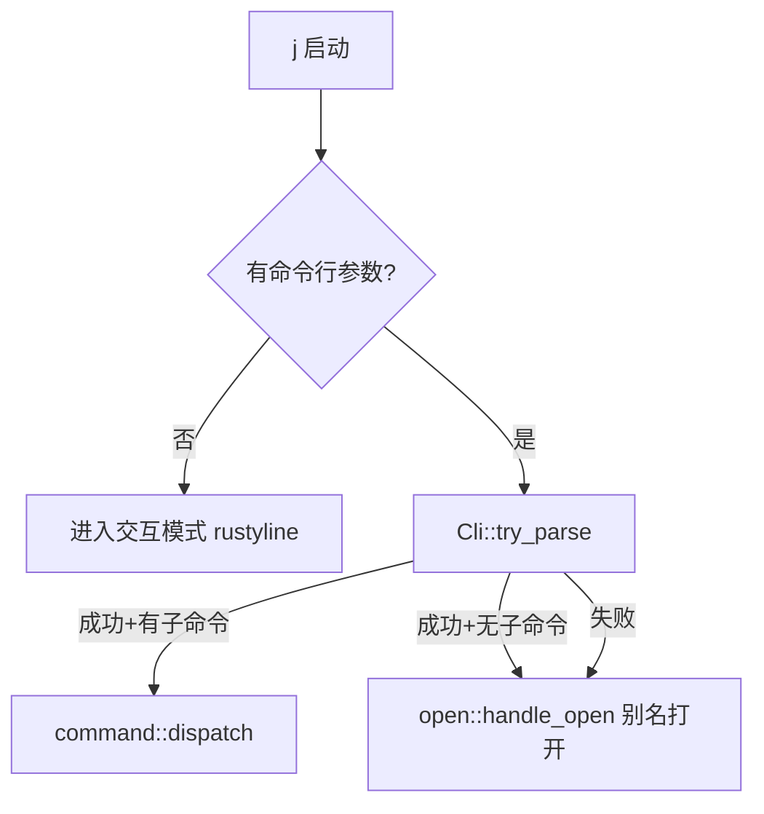

### 5.2 命令解析 — `cli.rs`

使用 `clap::derive` 宏，所有子命令定义在 `SubCmd` 枚举中：

| 子命令 | 别名 | 参数 | 说明 |
|--------|------|------|------|
| `set` | `s` | `<alias> <path...>` | 设置别名 |
| `remove` | `rm` | `<alias>` | 删除别名 |
| `rename` | `rn` | `<alias> <new>` | 重命名 |
| `modify` | `mf` | `<alias> <path...>` | 修改路径 |
| `note` | `nt` | `<alias> <category>` | 标记分类 |
| `denote` | `dnt` | `<alias> <category>` | 解除分类 |
| `list` | `ls` | `[section]` | 列出别名 |
| `contain` | `find` | `<alias> [sections]` | 查找别名所在分类 |
| `report` | `r` | `<content...>` | 写入日报 |
| `reportctl` | `rctl` | `<new\|sync\|push\|pull\|set-url\|open> [arg]` | 日报元数据操作 |
| `check` | `c` | `[line_count\|open]` | 查看最近 N 行日报 / TUI 编辑器打开日报文件 |
| `search` | `select/look/sch` | `<N\|all> <kw> [-f]` | 搜索日报 |
| `todo` | `td` | `[content...]` | 待办备忘录（无参数进入 TUI 管理界面，有参数快速添加） |
| `chat` | `ai` | `[content...]` | AI 对话（无参数进入 TUI 界面，有参数快速提问） |
| `concat` | — | `<name> [content]` | 创建脚本（无 content 则打开 TUI 编辑器） |
| `time` | — | `<countdown> <dur>` | 倒计时器 |
| `log` | — | `<key> <value>` | 日志设置 |
| `change` | `chg` | `<part> <field> <val>` | 修改配置 |
| `clear` | `cls` | — | 清屏 |
| `version` | `v` | — | 版本信息 |
| `help` | `h` | — | 帮助信息 |
| `exit` | `q/quit` | — | 退出 |
| `voice` | `vc` | `[-c] [-m model] / download [-m model]` | 语音转文字（录音 → Whisper 离线转写） |
| `completion` | — | `[zsh\|bash]` | 生成 shell 补全脚本 |

### 5.3 配置管理 — `config/yaml_config.rs`

- **配置文件路径**：`~/.jdata/config.yaml`（不存在则自动创建）
- 数据结构：`YamlConfig` 包含多个 `BTreeMap<String, String>` section
- Section 列表：`path`, `inner_url`, `outer_url`, `editor`, `browser`, `vpn`, `script`, `report`, `settings`
- **核心 API**：

| 方法 | 说明 |
|------|------|
| `YamlConfig::load()` | 加载配置（不存在则创建默认） |
| `data_dir()` | 获取数据根目录 `~/.jdata/` |
| `scripts_dir()` | 获取脚本存储目录 `~/.jdata/scripts/` |
| `get_property(section, key)` | 读取某 section 下的 key |
| `set_property(section, key, val)` | 写入并自动持久化 |
| `remove_property(section, key)` | 删除并持久化 |
| `contains(section, key)` | 判断是否存在 |
| `get_section(name)` | 获取整个 section 的 Map |
| `find_alias(alias)` → `(section, value)` | 在 path/inner_url/outer_url 中查找别名 |
| `is_verbose()` | 是否开启 verbose 日志 |

### 5.4 交互模式 — `interactive.rs`

- 基于 `rustyline` 15，自定义 `CopilotHelper`（实现 Completer + Hinter + Highlighter + Validator）
- **Tab 补全**：上下文感知
  - 第一个词 → 补全所有命令名 + 已注册别名
  - `rm/rename/mf/note/denote <Tab>` → 补全已有别名
  - `note <alias> <Tab>` → 补全分类（browser/editor/vpn/outer_url/script）
  - `ls/change <Tab>` → 补全 section 名
  - `log <Tab>` → 补全 `mode`，`log mode <Tab>` → 补全 `verbose/concise`
  - `search <Tab>` → 补全 `all`
  - `reportctl <Tab>` → 补全 `new/sync/push/pull/set-url/open`
  - `set <alias> /App<Tab>` → 补全文件系统路径
  - `mf <alias> /App<Tab>` → 补全文件系统路径
  - `time <Tab>` → 补全 `countdown`
- **历史建议**：`HistoryHinter`（灰色显示上次相同前缀的命令，按 → 接受）
- **历史持久化**：`~/.jdata/history.txt`
- **脚本统一存储**：`concat` 创建的脚本持久化在 `~/.jdata/scripts/` 下，不再依赖 `script.depot` 配置
- **Shell 命令**：`!` 前缀执行系统命令（如 `!ls -la`），自动注入别名环境变量；单独输入 `!` 进入交互式 shell 模式（提示符变为绿色 `shell >`），状态延续，`exit` 返回 copilot
- **环境变量注入**：进入交互模式时自动注入所有别名路径为 `J_<ALIAS_UPPER>` 环境变量，参数中 `$J_XXX` / `${J_XXX}` 自动展开
- **内部命令解析**：`parse_interactive_command()` 将输入行解析为三态 `ParseResult` 枚举（`Matched` / `Handled` / `NotFound`），避免参数不足时误 fallback 到别名查找

### 5.5 打开命令 — `command/open.rs`

这是用户使用最频繁的核心命令，支持多种打开模式：

```
j <alias>                   → 直接打开（app/文件/URL）
j <browser> <url_alias>     → 用指定浏览器打开 URL
j <browser> <任意文本>      → 用浏览器搜索（Google/Bing）
j <editor> <文件路径>       → 用编辑器打开文件
j <alias> <额外参数...>     → 带参数打开（如 j vscode ./src）
j <script_alias> -w         → 在新终端窗口中执行脚本
j <script_alias> -w <args>  → 在新终端窗口中执行脚本并传递参数
```

判断逻辑：
1. 检查第一个参数是否在 browser section → 是则走浏览器打开逻辑
2. 检查第一个参数是否在 editor section → 是则走编辑器打开逻辑
3. 检查是否在 VPN section → 系统 open 打开
4. 检查是否在 script section → 执行脚本（支持 `-w` 新窗口标志）
5. 查找别名对应的路径 → **智能判断**：
  - **CLI 可执行文件**（普通文件 + 可执行权限，非 `.app`）→ `Command::new()` 在当前终端执行，继承 stdin/stdout，支持管道
  - **GUI 应用**（`.app` 目录）/ 其他文件 → 系统 `open` 命令打开
6. 未注册 → 提示未找到

### 5.6 待办备忘录 — `command/todo.rs`

- **数据存储**：`~/.jdata/todo/todo.json`（独立目录，JSON 格式持久化）
- **入口方式**：
  - `j todo` / `j td` — 进入全屏 TUI 待办管理界面
  - `j todo add 买牛奶` — 快速添加一条待办
  - `j todo list` / `j td list` — 输出待办列表（Markdown 格式渲染）
  - 交互模式下 `todo` / `td` 同样可用

**TUI 界面**：基于 ratatui + crossterm 的全屏交互界面

| 按键 | 功能 |
|------|------|
| `n` / `↓` / `j` | 向下移动 |
| `N` / `↑` / `k` | 向上移动 |
| `空格` / `回车` | 切换完成状态（`[x]` ↔ `[ ]`） |
| `a` | 添加新待办（进入输入模式） |
| `e` | 编辑选中待办 |
| `d` | 删除待办（需 `y` 确认） |
| `f` | 过滤切换（全部 → 未完成 → 已完成） |
| `J` / `K` | 调整待办顺序（下移 / 上移） |
| `s` | 手动保存 |
| `Alt+↑` / `Alt+↓` | 预览区滚动（长待办内容时可用） |
| `q` / `Esc` | 退出（自动保存） |
| `Ctrl+C` | 强制退出 |

**UI 特性**：
- 标题栏显示统计信息：`📋 待办备忘录 — 共 N 条 | ✅ M | ⬜ K`
- 列表项显示 checkbox：`[x]` 已完成（绿色 + 删除线），`[ ]` 未完成（黄色）
- 创建时间附在每项末尾（灰色短日期）
- 底部帮助栏显示当前模式可用快捷键
- 空列表提示 `(空) 按 a 添加新待办...`
- 过滤模式标记在标题栏显示 `[未完成]` / `[已完成]`
- 未保存修改时状态栏显示红色 `[未保存]` 提示
- **预览区**：长待办内容时自动显示完整内容预览，支持 Alt+↑/↓ 滚动查看

### 5.7 日报系统 — `command/report.rs`

- **report**：写入日报（自动追加日期前缀，自动检测是否需要新开一周）
- **reportctl new**：手动推进周数（week_num + 1）
- **reportctl sync**：从 `settings.json` 同步周数和日期到 YAML 配置
- **reportctl push [message]**：推送周报到远程 git 仓库（自动 add + commit + push）
- **reportctl pull**：从远程 git 仓库拉取最新周报（支持首次 clone 和后续 pull）
- **reportctl set-url [url]**：设置/查看 git 远程仓库地址（设置后自动同步 git remote origin）
- **reportctl open**：用内置 TUI 编辑器打开日报文件全文编辑（NORMAL 模式），保存后整体回写
- **check [N]**：从文件尾部读取最后 N 行（高效实现，不全量读取）
- **search**：在日报中按关键字搜索，支持精确匹配和模糊匹配（`-f`），匹配内容绿色高亮
- **默认路径**：`~/.jdata/report/week_report.md`（无需配置，自动创建目录和文件）
- **自定义路径**：通过 `j change report week_report <path>` 设置
- **git 仓库同步**：通过 `j reportctl set-url <repo_url>` 配置远程仓库
- **git remote 自动同步**：`set-url` 更新地址后自动同步 git remote origin，`push`/`pull` 前也会自动校验并修正
- **unborn branch 处理**：`pull` 时自动检测空仓库（`git init` 后无 commit），使用 `fetch` + `reset --hard` 而非 `pull --rebase`

### 5.8 模糊匹配 — `util/fuzzy.rs`

- `fuzzy_match(content, target)` — 大小写不敏感的子串匹配
- `get_match_intervals(content, target)` — 获取所有匹配区间（UTF-8 char boundary 安全）
- `highlight_matches(content, target, fuzzy)` — 将匹配部分 ANSI 绿色高亮

### 5.9 日志宏 — `util/log.rs`

| 宏 | 输出格式 | 颜色 |
|----|----------|------|
| `info!(...)` | 直接输出 | 无（默认终端色） |
| `error!(...)` | 直接输出 | 红色 |
| `usage!(...)` | `"Usage: ..."` 前缀 | 黄色 |
| `debug_log!(config, ...)` | 仅 verbose 模式输出 | 蓝色 |

### 5.9.1 Markdown 渲染 — `util/md_render.rs`

| 宏 | 输出格式 | 颜色 |
|----|----------|------|
| `md!(...)` | Markdown 渲染输出（优先嵌入的 `ask` 引擎，fallback termimad） | 终端原生 |
| `md_inline!(...)` | 单行 Markdown 内联渲染（termimad） | 终端原生 |

### 5.10 全局常量 — `constants.rs`

所有散落在各模块中的魔法字符串和重复定义都已统一到 `constants.rs` 中集中管理：

| 常量组 | 内容 | 引用者 |
|--------|------|--------|
| `VERSION` / `APP_NAME` / `AUTHOR` / `EMAIL` | 版本信息 | cli.rs, yaml_config.rs, system.rs |
| `section::*` | section 名称（PATH, INNER_URL, OUTER_URL 等） | 几乎所有 command 模块 |
| `ALL_SECTIONS` | 所有 section 名称列表 | yaml_config.rs, interactive.rs |
| `DEFAULT_DISPLAY_SECTIONS` | ls 默认展示的 section | list.rs |
| `CONTAIN_SEARCH_SECTIONS` | contain 默认搜索的 section | system.rs |
| `NOTE_CATEGORIES` | 可标记分类列表 | category.rs, interactive.rs |
| `ALIAS_PATH_SECTIONS` | 别名路径查找 section | yaml_config.rs, interactive.rs |
| `ALIAS_EXISTS_SECTIONS` | 别名存在性检查 section | yaml_config.rs |
| `MODIFY_SECTIONS` / `REMOVE_CLEANUP_SECTIONS` / `RENAME_SYNC_SECTIONS` | 别名 CRUD 关联 section | alias.rs |
| `config_key::*` | 配置 key 名称（MODE, VERBOSE, SEARCH_ENGINE, GIT_REPO 等） | yaml_config.rs, system.rs, open.rs, report.rs, interactive.rs |
| `search_engine::*` | 搜索引擎 URL 模板 | open.rs |
| `REPORT_DATE_FORMAT` / `DEFAULT_CHECK_LINES` / `REPORT_DIR` / `REPORT_DEFAULT_FILE` | 日报相关常量 | report.rs, yaml_config.rs |
| `INTERACTIVE_PROMPT` / `HISTORY_FILE` / `CONFIG_FILE` 等 | 路径和文件名 | interactive.rs, yaml_config.rs |

### 5.11 公共工具函数 — `util/mod.rs`

- `remove_quotes(s: &str) -> String` — 去除字符串两端的引号（单引号或双引号），被 `alias.rs` 和 `open.rs` 共同复用。

---

## 六、数据目录与配置文件

所有用户数据统一存放在 `~/.jdata/` 下（可通过 `J_DATA_PATH` 环境变量自定义）：

配置文件位于 `~/.jdata/config.yaml`：

```
~/.jdata/
├── config.yaml          # 主配置文件（别名、分类、设置等）
├── history.txt          # 交互模式历史记录
├── bin/                 # 嵌入的二进制工具（首次运行自动释放）
│   └── ask              # Markdown 终端渲染引擎（从编译产物中释放）
├── scripts/             # concat 创建的脚本持久化存储
│   ├── my-script.sh
│   └── ...
├── todo/                # 待办备忘录目录
│   └── todo.json          # 待办数据（JSON 格式）
├── voice/               # 语音转文字目录
│   ├── model/             # Whisper 模型存储
│   │   └── ggml-small.bin # Whisper 模型文件（首次使用时下载）
│   └── recording.wav      # 临时录音文件（转写后自动删除）
└── report/              # 日报目录（默认路径，可配置 git 仓库同步）
    ├── week_report.md     # 周报文件
    ├── settings.json      # 日报配置（week_num, last_day）
    └── .git/              # git 仓库（push/pull 后自动生成）
```

```yaml
path:
  chrome: /Applications/Google Chrome.app
  vscode: /Applications/Visual Studio Code.app
  wechat: /Applications/WeChat.app

inner_url:
  github: https://github.com

outer_url:
  docs: https://docs.example.com

browser:
  chrome: chrome

editor:
  vscode: vscode

vpn: {}

script:
  my-script: /path/to/my-script.sh

report:
  week_report: /custom/path/to/week_report.md  # 可选，自定义日报文件路径（不配置则使用 ~/.jdata/report/week_report.md）
  git_repo: https://github.com/xxx/report.git  # 可选，远程 git 仓库地址
  week_num: "5"
  last_day: "2026.02.15"

settings:
  mode: concise    # verbose | concise
```

**Section 说明**：
- `path`：本地应用 / 文件路径
- `inner_url`：内网 URL（直接打开）
- `outer_url`：外网 URL（需要 VPN 的，会先启动 VPN 再打开）
- `browser`：浏览器列表（值为 path section 中的 key）
- `editor`：编辑器列表（值为 path section 中的 key）
- `vpn`：VPN 应用列表
- `script`：已注册的脚本路径
- `report`：日报系统配置
- `settings`：全局设置（日志模式等）

---

## 七、安装

### 方式一：一键安装（推荐）

使用安装脚本自动检测平台并安装：

```bash
# 安装最新版本
curl -fsSL https://raw.githubusercontent.com/LingoJack/j/main/install.sh | sh

# 安装指定版本
curl -fsSL https://raw.githubusercontent.com/LingoJack/j/main/install.sh | sh -s -- v1.0.0
```

安装后二进制文件位于 `/usr/local/bin/j`。

**卸载**：
```bash
curl -fsSL https://raw.githubusercontent.com/LingoJack/j/main/install.sh | sh -s -- --uninstall
```

### 方式二：从 crates.io 安装

```bash
# 安装
cargo install j-cli

# 验证
j version
```

安装后二进制文件位于 `~/.cargo/bin/j`，请确保 `~/.cargo/bin` 已加入 PATH：

```bash
# 检查 PATH
echo $PATH | grep -o ".cargo/bin"

# 如果没有，添加到 ~/.zshrc 或 ~/.bashrc
export PATH="$HOME/.cargo/bin:$PATH"
```

### 方式三：从 GitHub Release 下载

手动下载预编译二进制（仅支持 macOS M 系列）：

```bash
# macOS ARM64 (M1/M2/M3/M4)
curl -fsSL https://github.com/LingoJack/j/releases/latest/download/j-darwin-arm64.tar.gz | tar xz
sudo mv j /usr/local/bin/
```

### 方式四：从源码安装

```bash
# 克隆仓库
git clone https://github.com/LingoJack/j.git
cd j

# 编译安装到 ~/.cargo/bin
cargo install --path .

# 或编译后手动复制
cargo build --release
sudo cp target/release/j /usr/local/bin/j
```

### 方式五：本地开发编译

```bash
cargo build           # Debug 编译
cargo run             # 运行（进入交互模式）
cargo run -- help     # 快捷模式执行 help
cargo run -- set chrome /Applications/Google\ Chrome.app
```

### 更新

```bash
# 更新到最新版本（cargo 会自动检测并安装新版本）
cargo install j-cli

# 查看当前版本
j version
```

> **注意**：`cargo install` 会自动检测 crates.io 上的最新版本并更新，无需先卸载。

### 卸载

```bash
# 卸载程序
cargo uninstall j-cli

# （可选）删除数据目录
rm -rf ~/.jdata
```

> **注意**：`cargo uninstall` 只会删除二进制文件，用户数据（`~/.jdata/`）会保留。如需彻底清理，请手动删除数据目录。

---

## 八、编译运行指南

### Release 编译
```bash
cargo build --release
# 二进制在 target/release/j，~17MB（内嵌 ask 渲染引擎）
```

### 使用方式
```bash
# 快捷模式
j chrome              # 打开 Chrome
j chrome github       # 用 Chrome 打开 github 别名对应的 URL
j chrome "rust lang"  # 用 Chrome 搜索 "rust lang"
j vscode ./src        # 用 VSCode 打开 src 目录
j report "完成功能开发"  # 写入日报
j check               # 查看最近 5 行日报
j todo                # 进入 TUI 待办管理界面
j todo add 买牛奶    # 快速添加一条待办
j time countdown 5m   # 5 分钟倒计时
j voice download      # 下载语音识别模型（首次使用）
j voice               # 录音 → 转写 → 输出文字
j voice -c            # 录音 → 转写 → 复制到剪贴板

# 交互模式
j                     # 进入 REPL
copilot > set chrome /Applications/Google Chrome.app
copilot > ls path
copilot > note chrome browser
copilot > !ls -la     # 执行 shell 命令
copilot > !            # 进入交互式 shell 模式
shell > cd /tmp        # 状态延续（提示符为绿色）
shell > ls             # 仍在 /tmp 目录
shell > exit           # 返回 copilot
copilot > exit
```

---

## 九、与 Java 版的对应关系

| Java 类 | Rust 模块 | 说明 |
|----------|-----------|------|
| `WorkCopilotApplication` | `main.rs` + `interactive.rs` | 入口 + 交互模式 |
| `CommandHandlerScanner` | `cli.rs` + `command/mod.rs` | 命令注册 + 分发（Java 反射 → Rust 枚举 match） |
| `YamlConfig` | `config/yaml_config.rs` | YAML 配置管理 |
| `SetCommandHandler` | `command/alias.rs::handle_set` | 设置别名 |
| `RemoveCommandHandler` | `command/alias.rs::handle_remove` | 删除别名 |
| `RenameCommandHandler` | `command/alias.rs::handle_rename` | 重命名别名 |
| `ModifyCommandHandler` | `command/alias.rs::handle_modify` | 修改路径 |
| `NoteCommandHandler` | `command/category.rs::handle_note` | 标记分类 |
| `DenoteCommandHandler` | `command/category.rs::handle_denote` | 解除分类 |
| `ListCommandHandler` | `command/list.rs::handle_list` | 列出别名 |
| `ContainCommandHandler` | `command/system.rs::handle_contain` | 查找别名 |
| `OpenCommandHandler` | `command/open.rs::handle_open` | 打开应用/URL |
| `ReportCommandHandler` | `command/report.rs::handle_report` | 写入日报 |
| `CheckReportCommandHandler` | `command/report.rs::handle_check` | 查看日报 |
| `SearchCommandHandler` | `command/report.rs::handle_search` | 搜索日报 |
| `ConcatCommandHandler` | `command/script.rs::handle_concat` | 创建脚本 |
| `TimeCommandHandler` | `command/time.rs::handle_time` | 倒计时器 |
| — | `command/todo.rs::handle_todo` | 待办备忘录（Rust 新增，Java 版无对应） |
| — | `command/chat.rs::handle_chat` | AI 对话 TUI（Rust 新增） |
| — | `command/voice.rs::handle_voice` | 语音转文字（Rust 新增） |
| `LogCommandHandler` | `command/system.rs::handle_log` | 日志设置 |
| `ChangeCommandHandler` | `command/system.rs::handle_change` | 修改配置 |
| `ClearCommandHandler` | `command/system.rs::handle_clear` | 清屏 |
| `CommandRunner` | `open::that()` + `std::process::Command` | 进程执行 |
| `FuzzyMatcher` | `util/fuzzy.rs` | 模糊匹配 |
| `LogUtil` | `util/log.rs`（日志宏）+ `util/md_render.rs`（Markdown 渲染） | 彩色日志 + Markdown 渲染 |
| JLine3 Completer | `interactive.rs::CopilotCompleter` | Tab 补全 |

---

## 十、关键设计决策

### 1. clap try_parse + fallback

Java 版手动 split 命令字符串，Rust 版利用 `Cli::try_parse()` 尝试解析：
- 成功 → 匹配到子命令 → dispatch
- 失败 → 不是内置命令 → 作为别名打开（`j chrome` 不是子命令，但是已注册别名）

### 2. 配置文件直接 serde 序列化

Java 版用 `commons-configuration2` 逐 key 读写。Rust 版将整个 YAML 结构映射为 `YamlConfig` struct，任何修改直接序列化整个结构写回文件。简单可靠，避免部分更新导致的不一致。

### 3. 交互模式命令解析独立于 clap

交互模式不走 `Cli::try_parse()`（因为那需要完整的 argv），而是自己实现了 `parse_interactive_command()` 函数，将输入行 split 后手动匹配到 `SubCmd` 枚举。这样可以共享同一套 dispatch 逻辑。

### 4. UTF-8 安全的模糊匹配

`fuzzy.rs` 中的 `get_match_intervals()` 使用 `char_indices()` 映射确保切片始终在 char boundary 上，避免中文等多字节字符导致 panic。

### 5. 全局常量集中管理

Phase 6 新增 `constants.rs` 统一维护所有魔法字符串，任何新增的 section、配置 key、版本号等应先在 `constants.rs` 中定义，再在各模块中引用。

### 6. CLI 工具智能识别（path 别名自动区分执行方式）

Phase 7 为 `open.rs` 增加了 `is_cli_executable()` 函数，自动判断 path 别名指向的是 CLI 可执行文件还是 GUI 应用：
- **CLI 可执行文件**（如 `/opt/homebrew/bin/rg`）→ `Command::new()` 在当前终端执行，stdin/stdout 继承，管道 `|` 可正常工作
- **GUI 应用**（如 `/Applications/Google Chrome.app`）→ 系统 `open` 命令打开新窗口
- **URL** → 继续使用系统 open

判断规则：
1. URL（http/https 开头）→ 非 CLI
2. `.app` 结尾或包含 `.app/` → macOS GUI 应用，非 CLI
3. 文件存在 + 是普通文件（非目录）+ 有可执行权限 → CLI 工具
4. Windows 上通过扩展名（.exe/.cmd/.bat/.com）判断

这使得用户无需关心注册在哪个 section，只需 `set rg /opt/homebrew/bin/rg`，`j rg pattern` 就能在当前终端执行并支持管道。

### 7. 日报系统默认路径 + git 远程同步

Phase 8 为日报系统增加了：

**默认路径机制**：
- 日报文件默认存储在 `~/.jdata/report/week_report.md`
- 无需用户手动配置 `report.week_report`，首次使用自动创建目录和文件
- 仍支持通过 `j change report week_report <path>` 自定义路径（优先级高于默认）
- 统一通过 `get_report_path()` 函数获取，消除了原来 5 处重复的获取逻辑

**git 远程同步**：
- 新增 `report.git_repo` 配置项，存储远程仓库地址
- `reportctl push [message]`：自动 git add + commit + push（统一 main 分支），支持自定义 commit message
- `reportctl pull`：智能判断三种场景——
  - 无 .git 目录 → `git clone -b main` 到日报目录，并自动备份已有文件
  - 有 .git 但无 commit（unborn branch）→ `git fetch origin main` + `git reset --hard origin/main`
  - 正常仓库 → `git stash` + `git pull origin main --rebase` + `git stash pop`
- push 时自动检测并初始化 git 仓库（git init -b main + remote add）
- `reportctl set-url` 更新地址后自动同步 git remote origin URL
- 每次 push/pull 前通过 `sync_git_remote()` 自动校验并修正 remote origin URL 与配置一致

### 8. 交互模式路径参数 Tab 补全

Phase 9 为交互模式增加了文件系统路径补全能力：

- `set <alias> <Tab>` 和 `mf <alias> <Tab>` 现在支持文件系统路径补全
- 支持绝对路径（`/Applications/<Tab>`）、相对路径、`~` 展开
- 自动区分目录（后缀 `/`）和文件
- 默认跳过隐藏文件（除非输入了 `.` 前缀）

### 9. 交互模式三态命令解析

Phase 10 将交互模式的 `parse_interactive_command()` 返回类型从 `Option<SubCmd>` 改为三态枚举 `ParseResult`：

```rust
enum ParseResult {
  Matched(SubCmd),  // 成功解析为内置命令 → dispatch
  Handled,          // 是内置命令但参数不足，已打印 usage → 不做任何事
  NotFound,         // 不是内置命令 → fallback 到别名查找
}
```

解决了原来 `None` 一值两义导致的 bug：内置命令参数不足时先打印 usage 提示，又误 fallback 到别名查找输出错误信息。

### 10. Markdown 终端渲染（嵌入二进制 + fallback）

Phase 11 + Phase 13 为所有富文本输出（help、version、ls、check）引入 Markdown 终端渲染：

**渲染引擎**：`ask`（Go 编写，基于 `go-term-markdown`，源码位于 `plugin/ask/code/main.go`）
- 从 stdin 读取 Markdown 文本，自动获取终端宽度，渲染后输出到 stdout
- 支持表格边框、列表圆点、代码高亮、引用块缩进等

**嵌入策略**：
- 编译时通过 `include_bytes!("../../plugin/ask/bin/ask-darwin-arm64")` 嵌入二进制到 `j` 中
- 首次调用 `md!` 宏时自动释放到 `~/.jdata/bin/ask`（chmod 755）
- 通过文件大小校验版本：重新编译 `j` 后若 ask 二进制大小变化则自动覆盖更新
- 仅支持 macOS ARM64（`#[cfg(all(target_os = "macos", target_arch = "aarch64"))]`）

**渲染策略（两级 fallback）**：
- **优先**：调用嵌入的 `ask` 二进制（管道 stdin → stdout，效果最佳）
- **fallback**：非 macOS ARM64 平台或释放失败时，退化到 `termimad` crate 渲染
- 通过 `md!` 宏统一调用，调用方无需关心渲染后端

**输出场景**：
- `help` — 命令帮助（标题 + 分组表格 + 提示列表）
- `version` — 版本信息表格
- `ls` — 别名列表表格
- `check` — 周报内容（周报本身就是 Markdown 格式，直接渲染）
- 简单状态提示（`✅`/`❌`/`💡`）继续使用 `info!`/`error!`/`usage!`

### 11. 交互模式历史隐私保护

Phase 11 将 `auto_add_history` 改为 `false`，手动控制历史记录：
- `report <content>` 命令**不记入历史**——日报内容属于隐私，不应在后续 history hint 中被泄露
- 其他所有命令（包括 `!` shell 命令）正常记录历史

### 12. TUI 多行编辑器（vim 模式全屏编辑）

Phase 14 + Phase 15 为 `report` 命令引入了基于 ratatui + tui-textarea 的全屏 TUI 多行编辑器：

**触发方式**：`j report`（无参数）→ 进入全屏 vim 模式编辑器，撰写日报内容后提交

**vim 模式支持**：
- **NORMAL** 模式：默认进入（与 vim 体验一致），支持 hjkl 移动、w/e/b 词跳转、gg/G 首尾跳转、yy/dd/cc 操作、u 撤销、Ctrl+R 重做
- **INSERT** 模式：i/a/o/O 进入，直接输入文本
- **VISUAL** 模式：v 进入选择，支持 y/d/c 操作
- **COMMAND** 模式：`:wq` / `:x` 提交，`:q` / `:q!` 退出
- **SEARCH** 模式：`/pattern` 搜索，`n` / `N` 跳转到下一个/上一个匹配

**快捷键**：
- `:q`：尝试退出，若有未保存改动则拒绝并显示警告（标题栏变红 + 提示信息）
- `:q!`：强制放弃退出（丢弃所有改动）
- `Ctrl+Q`：任何模式下强制取消退出（等价 `:q!`）
- `Ctrl+S`：任何模式下快速提交
- `Esc`：INSERT → NORMAL 模式切换
- `/`：进入搜索模式，输入 pattern 后按 Enter 执行搜索
- `n`：跳转到下一个匹配
- `N`：跳转到上一个匹配

**日报 TUI 特性**：
- 进入编辑器时自动预加载日报文件**最后 3 行**作为上下文（可编辑修改）
- 自动预填日期前缀行（如 `- 【2026/02/11】 `），光标定位到末尾
- 默认 NORMAL 模式进入，与 vim 体验完全一致
- 提交后将编辑器全部内容**原样写入**文件（替换末尾历史行 + 追加新内容）
- 自动检测并处理新周标题（跨周时自动追加 `# WeekN[...]` 标题）

**UI 特性**：
- 底部状态栏实时显示当前模式（带颜色标签）+ 快捷键提示 + 行数
- COMMAND 模式下状态栏显示实时输入的命令（如 `:wq`）
- 编辑区支持行号显示、光标行下划线

### 13. 脚本新窗口执行（`-w` / `--new-window`）

Phase 16 为脚本执行增加了新窗口模式支持：

**使用方式**：
```bash
j my-script -w                # 在新终端窗口中执行脚本
j my-script -w arg1 arg2      # 带参数在新窗口中执行
j my-script arg1              # 默认在当前终端执行（行为不变）
```

**实现原理**（跨平台）：
- **macOS**：通过 `osascript` 调用 AppleScript，向 `Terminal.app` 发送 `do script` 命令在新窗口中执行
- **Windows**：使用 `start cmd /c` 在新的 cmd 窗口中执行
- **Linux**：依次尝试 `gnome-terminal`、`xterm`、`konsole`，全部失败则降级到当前终端执行

**设计要点**：
- `-w` / `--new-window` 标志从参数列表中过滤后再传递给脚本，脚本本身不会收到该标志
- 参数中包含空格等特殊字符时自动 shell 转义（`shell_escape()` 函数）
- 新窗口执行是非阻塞的（macOS/Windows），即 `j` 命令立即返回，脚本在后台窗口继续运行
- 新窗口执行**不强制追加等待按键**逻辑，由脚本自身决定是否包含（通过 TUI 编辑器创建时模板中预填，命令行直接传入时不添加）

### 14. 资源文件外置 + 编译时嵌入

Phase 12 将 `system.rs` 中硬编码的大段 Markdown 文本（帮助文档、版本信息模板）抽取到独立的 `assets/*.md` 文件中：

**文件结构**：
```
assets/
├── help.md        # 完整帮助文档（~80 行 Markdown 表格 + 列表）
└── version.md     # 版本信息模板（使用 {version}/{os}/{extra} 占位符）
```

**嵌入方式**：通过 Rust 的 `include_str!` 宏在编译时将文件内容嵌入为 `&'static str` 常量：
```rust
const HELP_TEXT: &str = include_str!("../../assets/help.md");
const VERSION_TEMPLATE: &str = include_str!("../../assets/version.md");
```

**优势**：
- 代码与展示文本解耦——修改帮助文档只需编辑 `.md` 文件，无需触碰 Rust 代码
- `.md` 文件可以直接用编辑器预览，方便排版和校对
- 编译时嵌入，运行时零开销（与硬编码字符串等价）
- 版本模板使用占位符（`{version}`、`{os}`、`{extra}`），运行时通过 `str::replace()` 填充动态值

### 15. 文件路径补全增强 + Shell 补全脚本生成

Phase 20 解决了两个层面的文件路径补全缺失问题：

**交互模式增强（rustyline）**：

原有逻辑：当第一个词是别名（非命令）时，后续参数只补全其他别名。现在改为根据别名类型智能选择补全策略：

| 别名类型 | 后续参数补全 | 典型场景 |
|----------|-------------|----------|
| **编辑器别名**（editor section） | 文件路径补全 | `vscode ./src<Tab>` |
| **浏览器别名**（browser section） | 别名 + 文件路径补全 | `chrome github<Tab>` 或 `chrome index.html<Tab>` |
| **其他别名**（CLI 工具等） | 文件路径 + 别名补全 | `rg pattern <Tab>` |

**快捷模式 Shell 补全脚本（`j completion`）**：

快捷模式下的 Tab 补全由 shell 负责（非程序内部 rustyline）。新增 `j completion [zsh|bash]` 命令，**动态读取当前配置**生成补全脚本：

```bash
# 方式 1：临时生效（当前 shell 会话）
eval "$(j completion zsh)"

# 方式 2：持久化（推荐）
j completion zsh > ~/.zsh/completions/_j
# 确保 fpath 包含该目录：fpath=(~/.zsh/completions $fpath)
# 然后在 .zshrc 中 autoload -Uz compinit && compinit

# Bash 用户
eval "$(j completion bash)"
# 或: j completion bash > /etc/bash_completion.d/j
```

补全脚本中包含的智能补全规则：
- 第一个参数：补全所有子命令名 + 已注册别名
- `set/modify` 命令：第二参数补全别名，第三参数补全文件路径
- `rm/rename/note/denote/contain` 命令：补全别名
- `reportctl` 命令：补全子操作（new/sync/push/pull/set-url/open）
- 编辑器类别名（如 `code`/`tp`）：后续参数用 `_files` 补全文件路径
- 浏览器类别名：后续参数补全别名 + 文件路径
- 其他别名/命令：默认文件路径 + 别名补全

**注意**：补全脚本是根据执行 `j completion` 时的配置快照生成的。如果新增/删除了别名，需要重新执行一次 `eval "$(j completion zsh)"` 更新补全列表。

### 16. 脚本环境变量注入 + 交互模式环境变量支持

Phase 21 为脚本执行和交互模式引入了别名路径环境变量自动注入：

**环境变量命名规则**：
- 前缀 `J_` + 别名转大写，`-` 转 `_`
- 示例：`chrome` → `J_CHROME`，`my-tool` → `J_MY_TOOL`
- 覆盖 section 优先级：`path` > `inner_url` > `outer_url` > `script`（同名别名只取优先级高的）

**注入方式（三种场景）**：

| 场景 | 注入方式 | 实现 |
|------|----------|------|
| 当前终端脚本执行 | `Command::env()` 直接注入子进程 | `inject_alias_envs()` |
| 新窗口脚本执行（`-w`） | 构建 `export K=V;` 语句拼接到命令前 | `build_env_export_string()` |
| 交互模式 `!` shell 命令 | `Command::env()` 注入 + 进程级 `set_var` | `execute_shell_command()` + `inject_envs_to_process()` |
| 交互模式 `!` 交互式 shell | `Command::env()` 注入（含自定义 PS1 提示符 `shell >`） | `enter_interactive_shell()` |

**交互模式增强**：
- 进入交互模式时自动调用 `inject_envs_to_process()` 将所有别名注入当前进程环境变量
- 参数中的 `$J_XXX` 和 `${J_XXX}` 引用通过 `expand_env_vars()` 函数自动展开
- 每次命令执行后刷新环境变量，确保别名变更能及时反映
- `set_var` 在 Rust 1.83+ 中是 unsafe，通过 `unsafe` 块包裹并注释安全理由（交互模式单线程）

**⚠️ 路径含空格注意事项**：
- 环境变量的值是**原始路径**（不含引号），如 `/Applications/Visual Studio Code.app`
- 在脚本中使用时**必须用双引号包裹**：`"$J_VSCODE"` 而非 `$J_VSCODE`
- 不加引号会被 shell 按空格拆分导致 `No such file or directory` 错误
- `shell_escape()` 函数仅在新窗口 `export` 语句中自动处理空格转义，脚本内部的变量引用由用户自行加引号

**`concat` 已有脚本编辑**：
- `j concat <name>` 当脚本名已存在时，不再报错，而是打开 TUI 编辑器预填已有脚本内容，支持修改后保存

---

## 十一、AI 对话系统 (`chat.rs`)

### 概述

`j chat` 命令启动内置 TUI AI 对话界面，支持多模型、流式输出、Markdown 渲染、对话持久化、工具调用等功能。

### 架构总览

```
src/command/chat/
├── mod.rs           # 入口：handle_chat() 命令分发
├── handler.rs       # TUI 主循环：事件监听 + 模式路由
├── app.rs           # 应用状态：ChatApp + 后台 Agent 循环
├── api.rs           # API 层：OpenAI 客户端 + 请求构建
├── model.rs         # 数据模型：AgentConfig / ChatSession / ChatMessage
├── tools.rs         # 工具系统：Tool trait + run_shell / read_file
├── archive.rs       # 归档管理：创建 / 列表 / 还原 / 删除
├── theme.rs         # 主题系统：6 种配色方案
├── render.rs        # 渲染工具：剪贴板复制
├── markdown/        # Markdown 解析渲染
│   ├── parser.rs    # pulldown-cmark 解析
│   └── highlight.rs # 代码语法高亮
└── ui/              # TUI 组件
    ├── chat.rs      # 对话主界面
    ├── config.rs    # 配置编辑界面
    └── archive.rs   # 归档列表界面
```

```
~/.jdata/agent/data/
├── agent_config.json    # 模型提供方配置（API key、模型名等）
├── chat_session.json    # 当前对话历史（自动保存/恢复）
└── archives/            # 归档对话存储目录
    ├── archive-2026-02-25.json
    └── archive-2026-02-26.json
```

### 整体交互流程

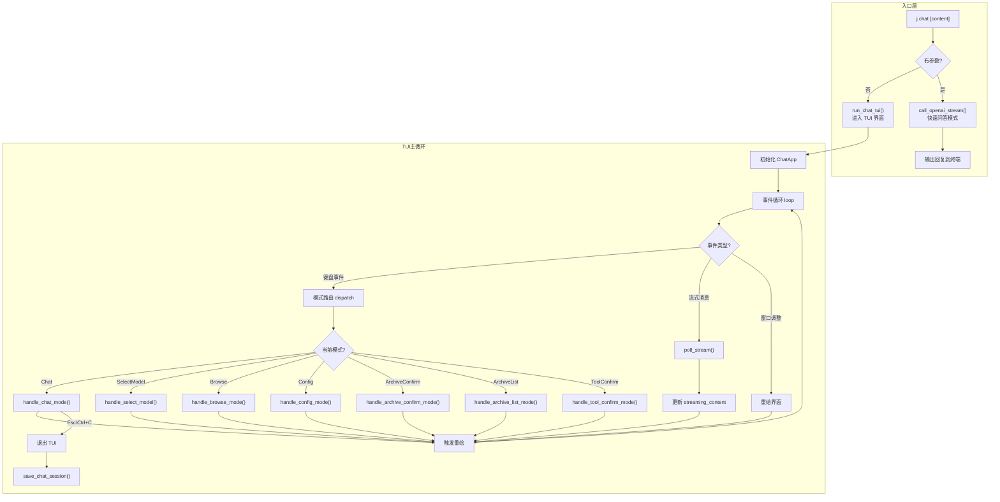

### 用户发送消息流程

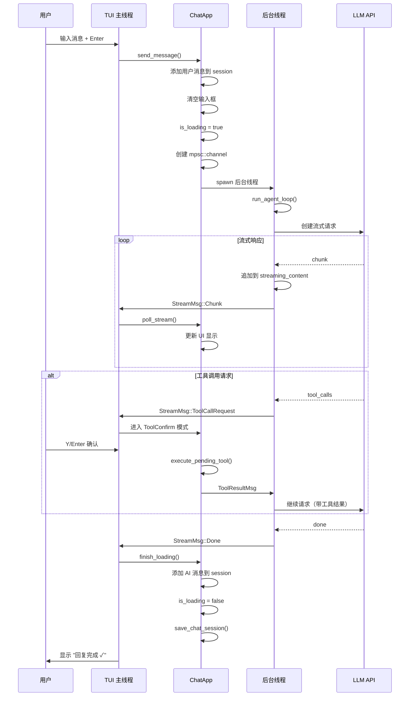

### Agent 循环（支持多轮工具调用）

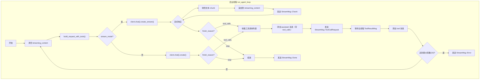

### 工具调用确认流程

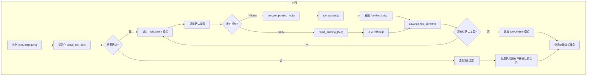

### 归档功能流程

```mermaid
flowchart TD
    subgraph 归档 Ctrl+L
        A["Ctrl+L"] --> B{"对话为空?"}
        B -- 是 --> C["提示: 当前对话为空"]
        B -- 否 --> D["start_archive_confirm()"]
        D --> E["生成默认名称 archive-YYYY-MM-DD"]
        E --> F["进入 ArchiveConfirm 模式"]
        F --> G{"用户操作?"}
        G -- "Enter" --> H["使用默认名称归档"]
        G -- "n" --> I["编辑自定义名称"]
        G -- "d" --> J["仅清空对话，不归档"]
        G -- "Esc" --> K["取消"]
        
        I --> L["输入自定义名称"]
        L --> M["Enter 确认"]
        M --> N["validate_archive_name()"]
        N -- "合法" --> H
        N -- "非法" --> O["提示错误，继续编辑"]
        
        H --> P["create_archive()"]
        P --> Q["保存到 archives/name.json"]
        Q --> R["清空当前 session"]
        R --> S["显示成功提示"]
    end

    subgraph 还原 Ctrl+R
        T["Ctrl+R"] --> U["start_archive_list()"]
        U --> V["加载归档列表"]
        V --> W["进入 ArchiveList 模式"]
        W --> X{"用户操作?"}
        X -- "↑↓/j/k" --> Y["移动选择"]
        X -- "Enter" --> Z{"当前有对话?"}
        X -- "d" --> AA["删除选中归档"]
        X -- "Esc" --> AB["取消返回"]
        
        Z -- 是 --> AC["提示确认覆盖"]
        Z -- 否 --> AD["直接还原"]
        AC -- "y/Enter" --> AD
        AC -- "其他" --> W
        
        AD --> AE["restore_archive()"]
        AE --> AF["替换 session.messages"]
        AF --> AG["显示成功提示"]
    end
```

### 配置编辑流程

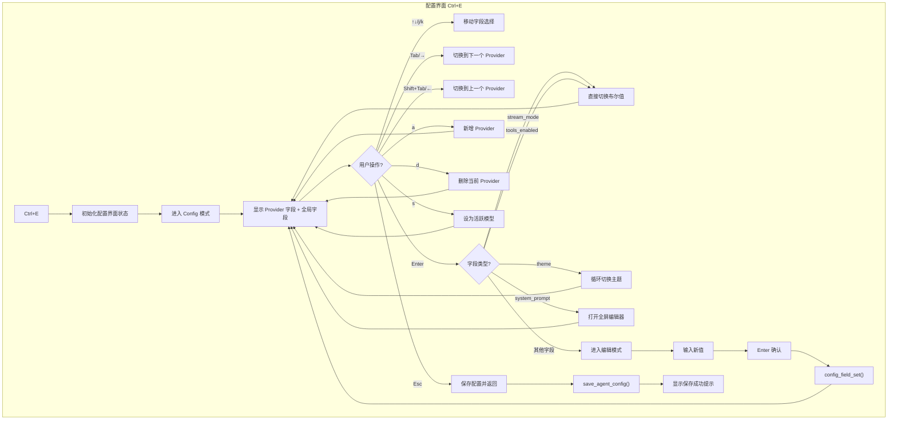

### 消息浏览模式流程

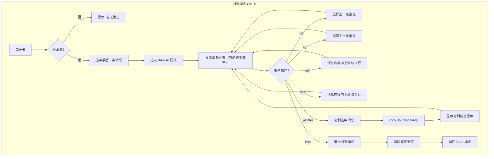

### 数据模型关系

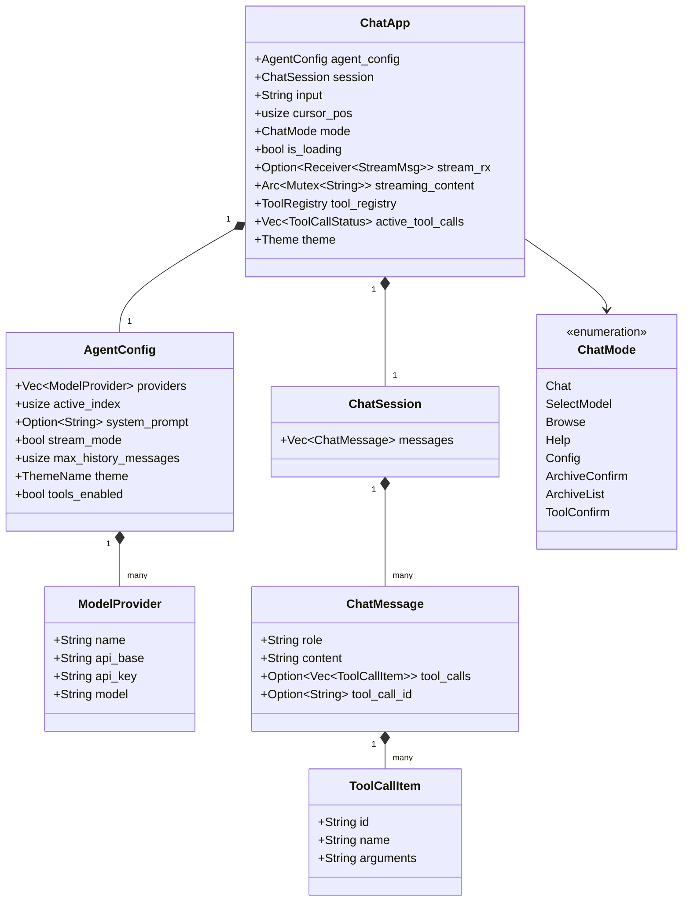

### 性能优化策略

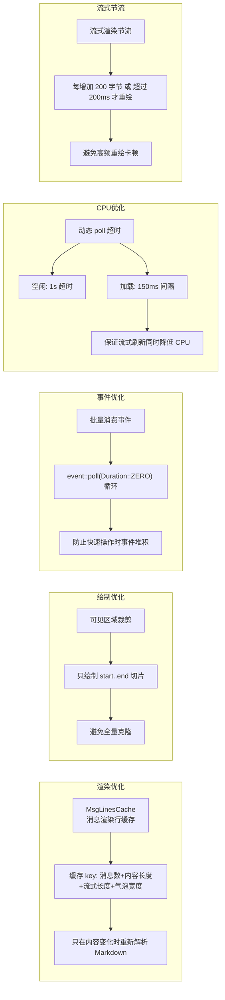

**核心优化点：**
- `MsgLinesCache`：消息渲染行缓存，打字/滚动时零开销复用
- 只渲染可见区域行（`start..end` 切片），避免全量克隆
- 批量消费事件（`event::poll(Duration::ZERO)` 循环），防止快速操作时事件堆积
- 空闲时 1s 超时降低 CPU，加载时 150ms 间隔保证流式刷新
- 流式节流：每增加 200 字节或超过 200ms 才重绘，避免高频重绘卡顿

### 配置示例

```json
{
  "providers": [
    {
      "name": "GPT-4o",
      "api_base": "https://api.openai.com/v1",
      "api_key": "sk-xxx",
      "model": "gpt-4o"
    },
    {
      "name": "DeepSeek-V3",
      "api_base": "https://api.deepseek.com/v1",
      "api_key": "sk-xxx",
      "model": "deepseek-chat"
    }
  ],
  "active_index": 0,
  "system_prompt": "你是一个有用的助手。",
  "stream_mode": true,
  "max_history_messages": 20,
  "theme": "dark",
  "tools_enabled": true
}
```

| 字段 | 说明 |
|------|------|
| `providers` | 模型提供方列表（支持任意 OpenAI 兼容 API） |
| `active_index` | 当前使用的 provider 索引 |
| `system_prompt` | 系统提示词（可选，每轮对话前注入） |
| `stream_mode` | `true` 流式输出（逐字显示），`false` 整体输出（等待完整回复） |
| `max_history_messages` | 发送给 API 的历史消息数量上限（默认 20，防止 token 超限） |
| `theme` | 界面主题风格（`dark`/`light`/`dracula`/`gruvbox`/`monokai`/`nord`） |
| `tools_enabled` | 是否启用工具调用功能（默认 `true`） |

### 配置界面

按 `Ctrl+E` 进入可视化配置界面：

| 按键 | 功能 |
|------|------|
| `↑` / `k` | 向上移动光标 |
| `↓` / `j` | 向下移动光标 |
| `Tab` / `→` | 切换到下一个 Provider |
| `Shift+Tab` / `←` | 切换到上一个 Provider |
| `Enter` | 进入编辑模式（修改当前字段） |
| `a` | 新增 Provider |
| `d` | 删除当前 Provider |
| `s` | 将当前 Provider 设为活跃模型 |
| `Esc` | 保存配置并返回对话 |

> **提示**：`stream_mode` 和 `theme` 字段直接按 `Enter` 切换，无需手动输入

### TUI 快捷键

| 按键 | 功能 |
|------|------|
| `Enter` | 发送消息 |
| `↑/↓` | 滚动对话 |
| `Ctrl+T` | 切换模型提供方 |
| `Ctrl+L` | 归档当前对话（保存并清空） |
| `Ctrl+R` | 还原归档对话 |
| `Ctrl+Y` | 快速复制最后一条 AI 回复 |
| `Ctrl+B` | 消息浏览模式（↑↓ 选择，y/Enter 复制，A/D 细粒度滚动内容） |
| `Ctrl+S` | 切换流式/整体输出（默认流式） |
| `Ctrl+E` | 打开配置界面（可视化编辑模型配置、主题等） |
| `?` | 显示帮助 |
| `Esc` | 退出对话 |

### 主题风格

支持 6 种主题风格，可在配置界面（`Ctrl+E`）中选中 `theme` 字段按 `Enter` 循环切换：

| 主题 | 说明 |
|------|------|
| `dark` | 深色主题（默认），适合深色终端 |
| `light` | 浅色主题，适合浅色终端 |
| `dracula` | Dracula 配色方案 |
| `gruvbox` | Gruvbox 复古配色 |
| `monokai` | Monokai 经典配色 |
| `nord` | Nord 北欧冷色调配色 |

### 归档对话功能

对话支持归档和还原，方便保存有价值的对话历史：

**归档对话（Ctrl+L）**：
- 按下 `Ctrl+L` 后，当前对话会被保存到归档
- 默认归档名称格式：`archive-YYYY-MM-DD`（如 `archive-2026-02-25`）
- 如果同名归档已存在，自动添加后缀（如 `archive-2026-02-25(1)`）
- 归档后当前会话自动清空

**还原归档（Ctrl+R）**：
- 按下 `Ctrl+R` 进入归档列表
- 使用 `↑` / `↓` 或 `j` / `k` 选择归档
- 按 `Enter` 还原选中的归档
- 按 `d` 删除选中的归档
- 按 `Esc` 取消返回

**归档存储位置**：`~/.j/chat/archives/`

> 提示：还原归档会先清空当前会话，如果当前有未归档的对话，还原时会提示确认

### 工具调用功能

AI 对话支持工具调用（Function Calling），让 AI 能够执行实际操作。

**启用方式**：在配置界面（`Ctrl+E`）中设置 `tools_enabled` 为 `true`（默认启用）

**内置工具**：

| 工具名 | 功能 | 需确认 |
|--------|------|--------|
| `run_shell` | 执行 shell 命令 | ✅ 是 |
| `read_file` | 读取本地文件 | ❌ 否 |

**工具确认流程**：

当 AI 请求执行需要确认的工具（如 `run_shell`）时：

1. 界面弹出确认框，显示工具名和参数
2. 按 `Y` / `Enter` 执行工具
3. 按 `N` / `Esc` 拒绝执行
4. AI 根据工具返回结果继续回复

**安全策略**：

`run_shell` 工具内置危险命令过滤，以下命令会被拒绝执行：
- `rm -rf /`、`rm -rf /*`
- `mkfs`、`dd if=`
- `chmod -R 777 /`、`chown -R`
- `curl | sh`、`wget -O- | sh`
- 等...

> 提示：即使有安全过滤，执行 shell 命令前仍建议仔细检查命令内容

### Skill 技能系统

Chat 支持用户自定义 Skill（技能），让 AI 在对话中遵循特定领域的指令模板。

**Skill 目录结构**：

```
~/.jdata/agent/skills/
  my-skill/
    SKILL.md           # 主文件（必需），YAML frontmatter + Markdown 正文
    references/        # 可选的参考文件目录
      api-docs.md
    scripts/           # 可选的脚本目录
      validate.sh
```

**SKILL.md 格式**：

```yaml
---
name: my-skill
description: 这个 skill 做什么
argument-hint: "[参数说明]"
---

Markdown 指令正文，$ARGUMENTS 会被替换为实际参数...
```

**使用方式**：

| 方式 | 说明 |
|------|------|
| `@skill_name` | 在输入框中输入 @ 触发技能选择弹窗，选择后自动补全 |
| `@skill_name 参数` | 输入 `@技能名 参数`，发送时 AI 会收到 skill 指令上下文 |
| 自动调用 | 启用 tools_enabled 后，AI 可通过 tool calling 自动发现并调用匹配的 skill |

**@ 补全弹窗快捷键**：

| 按键 | 功能 |
|------|------|
| `@` | 触发技能选择弹窗（需在行首或空格之后） |
| `↑` / `↓` | 在弹窗中移动选中项 |
| `Tab` / `Enter` | 补全选中的技能名称 |
| `Esc` | 关闭弹窗 |

**@ mention 高亮**：输入框中的 `@skill_name` 会以绿色加粗显示

**创建示例 Skill**：

```bash
mkdir -p ~/.jdata/agent/skills/code-expert
cat > ~/.jdata/agent/skills/code-expert/SKILL.md << 'EOF'
---
name: code-expert
description: 编程专家，帮助用户回答编程问题
argument-hint: "[编程语言]"
---

你是一个专精 $ARGUMENTS 的编程专家。请用简洁的代码示例回答用户的问题。
EOF
```

> Skill 的 `references/` 目录下的文件会作为参考上下文自动附加，总内容截断到 12000 字节

### Markdown 渲染

`markdown_to_lines()` 基于 `pulldown-cmark` 解析，支持：
- 标题（`#` → `>>` 前缀 + 蓝色加粗）
- **加粗**、*斜体*、~~删除线~~
- 行内代码（`` ` `` → 黄色背景）
- 代码块（语法高亮 + 边框 + 行号区）
- 列表（有序/无序，支持嵌套）
- 表格（自动列宽 + 边框 + 表头高亮）
- 引用块（`>` → 左竖线 + 淡色）
- 分隔线

### 代码高亮支持语言

`highlight_code_line()` 对以下语言提供关键字/字符串/注释/数字着色：

| 语言 | 标识 |
|------|------|
| Rust | `rust`, `rs` |
| Python | `python`, `py` |
| JavaScript/TypeScript | `js`, `ts`, `jsx`, `tsx` |
| Go | `go`, `golang` |
| Java/Kotlin | `java`, `kotlin`, `kt` |
| Bash/Shell | `sh`, `bash`, `zsh`, `shell` |
| C/C++ | `c`, `cpp`, `c++`, `h`, `hpp` |
| SQL | `sql` |
| Ruby | `ruby`, `rb` |
| YAML/TOML | `yaml`, `yml`, `toml` |
| CSS/SCSS | `css`, `scss`, `less` |
| Dockerfile | `dockerfile`, `docker` |
| 其他 | 通用关键字高亮 |

**Rust 额外支持**：
- **关键字高亮（紫色）**：`fn`、`let`、`mut`、`pub`、`struct`、`enum`、`impl`、`trait`、`match`、`if`、`else`、`for`、`while`、`loop`、`return` 等控制流/定义关键字
- **原始类型高亮（青绿色）**：`i32`、`u64`、`f64`、`bool`、`char`、`str` 等
- **类型名高亮（暖黄色）**：大写开头的类型名如 `Vec`、`String`、`Option`、`Result`、`HashMap`、`Clone`、`Debug`、`Iterator` 等 Trait 名
- **宏调用高亮（淡蓝色）**：`println!`、`vec!`、`panic!`、`format!` 等（自动识别 `word!` 形式）
- **生命周期参数高亮（暖黄色）**：`'a`、`'static` 等生命周期参数
- **属性高亮（青绿色）**：`#[derive(...)]`、`#[cfg(...)]` 等属性

Bash 额外支持 `$VAR`、`${VAR}`、`$(cmd)` 变量高亮。

**Go 额外支持**：
- **关键字高亮（紫色）**：`func`、`package`、`import`、`return`、`if`、`else`、`for`、`range`、`struct`、`interface`、`type`、`var`、`const`、`defer`、`go`、`chan`、`select`、`switch` 等
- **内建类型高亮（青绿色）**：`int`、`int32`、`int64`、`uint`、`float64`、`bool`、`byte`、`rune`、`string`、`error`、`any` 等
- **标准库类型高亮（暖黄色）**：`Reader`、`Writer`、`Context`、`Mutex`、`WaitGroup`、`Request`、`Response`、`Buffer` 等常见类型和接口
- **大写开头标识符不误判**：Go 的导出函数（如 `Println`、`HandleFunc`）不会被错误地标记为类型色，只有显式类型列表中的才高亮

---

## 十二、语音转文字 (`voice.rs`)

### 概述

`j voice` 命令提供基于 Whisper.cpp 的离线语音转文字功能，支持中文识别，无需联网。

### 架构

```
~/.jdata/voice/
├── model/
│   └── ggml-small.bin    # Whisper 模型文件（首次使用时通过 j voice download 下载）
└── recording.wav         # 临时录音文件（转写后自动删除）
```

### 核心流程

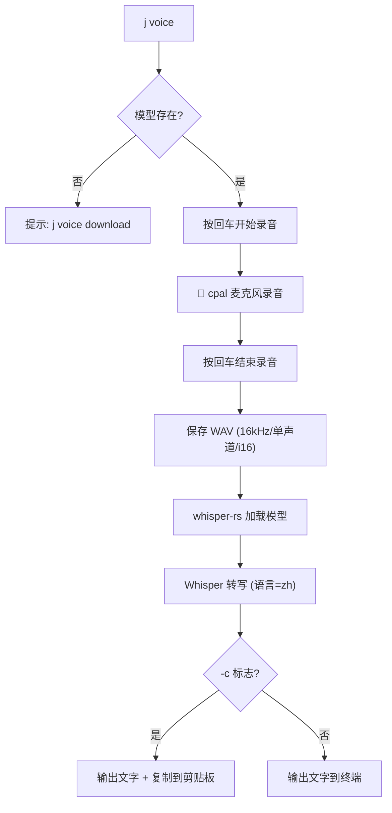

### 使用方式

```bash
# 首次使用：下载模型（默认 small，466MB，中文效果好）
j voice download
j voice download -m medium    # 下载 medium 模型（1.5GB，中文最佳）

# 录音转文字
j voice                       # 录音 → 转写 → 输出到终端
j voice -c                    # 录音 → 转写 → 复制到剪贴板
j voice -m medium             # 使用 medium 模型转写
j vc                          # 别名，等价于 j voice

# 配合其他命令使用
j report "$(j voice)"         # 语音写日报
j todo "$(j voice)"           # 语音添加待办
```

### 模型选择

| 模型 | 大小 | 中文质量 | 速度（M1 30s音频）| 推荐度 |
|------|------|---------|-----------------|--------|
| `tiny` | 75MB | ⭐⭐ | <1s | 不推荐中文 |
| `base` | 142MB | ⭐⭐⭐ | ~1s | 凑合用 |
| `small` | 466MB | ⭐⭐⭐⭐ | ~2s | ✅ 默认推荐 |
| `medium` | 1.5GB | ⭐⭐⭐⭐⭐ | ~3s | ✅ 中文最佳 |
| `large` | 3.1GB | ⭐⭐⭐⭐⭐ | ~6s | 追求极致精度 |

### 技术实现

- **录音**：`cpal` crate 捕获系统默认麦克风，16kHz 单声道 f32 采样，实时转 i16
- **WAV 写入**：`hound` crate 将采样数据写入 16bit PCM WAV 文件
- **转写**：`whisper-rs` crate（Whisper.cpp 的 Rust 绑定），Greedy 解码策略，语言设为中文
- **模型下载**：通过 `curl` 从 Hugging Face 下载 ggml 格式模型文件
- **剪贴板**：macOS 通过 `pbcopy` 复制

### 注意事项

- 首次录音时 macOS 会弹出麦克风权限请求，需要用户授权
- 编译需要系统安装 `cmake`（`brew install cmake`），因为 whisper-rs 需要编译 whisper.cpp
- 模型文件较大，不嵌入二进制，需要用户首次使用时手动下载

---

## 十三、未来可优化方向

| 方向 | 说明 | 优先级 |
|------|------|--------|
| **runner.rs 抽取** | 将进程执行逻辑从 `open.rs` 抽取为独立的 `runner.rs` 模块 | 低 |
| **单元测试** | 为核心模块（配置管理、模糊匹配、命令解析）添加单元测试 | 中 |
| **错误处理** | 用 `anyhow` 或 `thiserror` 统一错误处理，替代分散的 `error!()` 宏 | 中 |
| **配置热更新** | 监听配置文件变化自动重载（交互模式下） | 低 |
| **插件系统** | 支持用户自定义命令脚本（类似 git alias） | 低 |
| **跨平台测试** | Windows / Linux 平台适配验证 | 中 |
| **自动更新** | `j update` 从 GitHub Release 自动下载最新版本 | 低 |
| **模糊搜索增强** | 支持 fzf 风格的模糊搜索算法（如 Smith-Waterman） | 低 |
| **AI agent 增强** | 工具调用（function calling）、上下文文件注入、多轮推理 | 中 |

---

## 十三、快速上手 Checklist

> 新接手项目的开发者请按以下步骤快速了解：

1. **阅读本文档** — 了解整体架构和设计决策
2. **阅读 `constants.rs`** — 了解所有全局常量定义
3. **`cargo run -- help`** — 查看所有可用命令
4. **`cargo run`** — 体验交互模式
5. **阅读 `cli.rs`** — 所有子命令的定义都在这里（SubCmd 枚举）
6. **阅读 `command/mod.rs`** — 了解命令如何分发到各 handler
7. **阅读 `config/yaml_config.rs`** — 了解配置文件的数据结构和操作 API
8. **阅读 `command/open.rs`** — 这是最核心的命令，理解打开逻辑
9. **阅读 `interactive.rs`** — 理解交互模式的补全器和命令解析
10. **查看 `~/.jdata/config.yaml`** — 实际配置文件，所有数据都在这里
11. **参考 `work-copilot-java/`** — Java 原版代码，逻辑一一对应

### 添加新命令的步骤

1. 在 `cli.rs` 的 `SubCmd` 枚举中添加新变体
2. 在 `command/` 下创建或修改对应的 handler 文件
3. 在 `command/mod.rs` 的 `dispatch()` 中添加匹配分支
4. 在 `command/mod.rs` 的 `all_command_keywords()` 中注册关键字
5. 在 `interactive.rs` 中添加补全规则 + `parse_interactive_command()` 分支
6. 在 `system.rs` 的 `handle_help()` 中更新帮助文本
