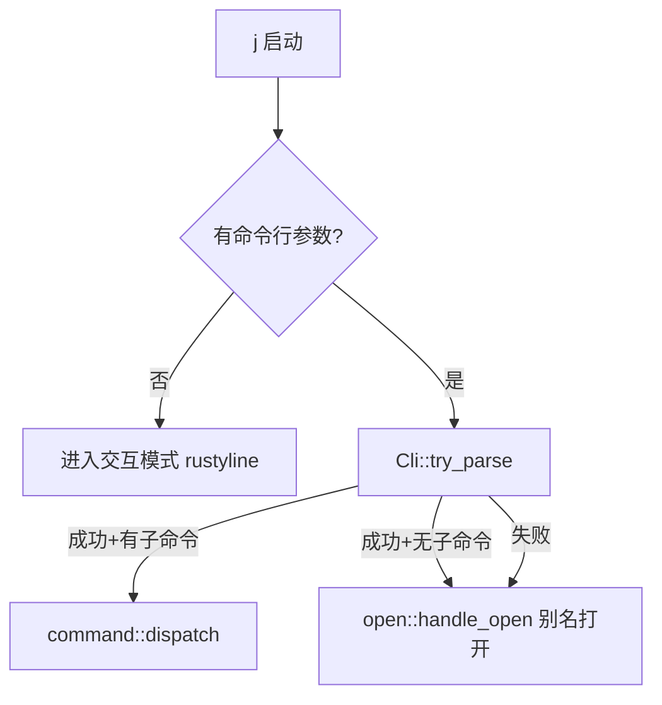

# work-copilot Rust 重构进度

> 📅 最后更新: 2026-02-11
> 🔖 版本: v12.0.0
> 📦 原项目: `work-copilot-java/`（Java CLI 工具）→ 用 Rust 完全重构

---

## 一、项目概述

`j` 是一个快捷命令行工具，核心功能：
- **别名管理**：注册 app 路径 / URL / 脚本，通过 `j <alias>` 快速打开
- **分类标记**：将别名标记为 browser / editor / vpn / outer_url / script，支持组合打开
- **日报系统**：快速写入日报、查看和搜索历史记录，自动周数管理
- **脚本创建**：一键创建 shell 脚本并注册为别名
- **交互模式**：带 Tab 补全 + 历史建议的 REPL 环境
- **倒计时器**：终端倒计时，带进度条和结束提醒

重构动机：**启动速度提升 10-100x**（JVM 冷启动 ~200-500ms → Rust 原生 ~2ms），**二进制仅 ~2.3MB 零依赖分发**。

---

## 二、当前架构

```
src/
├── main.rs              # 入口：clap 解析 + 快捷/交互模式分流
├── cli.rs               # clap derive 宏定义所有子命令（SubCmd 枚举）
├── constants.rs         # 全局常量定义（版本号、section名、分类、搜索引擎等）
├── interactive.rs       # 交互模式（rustyline + 自定义补全器 + 历史建议）
├── config/
│   ├── mod.rs           # 导出 YamlConfig
│   └── yaml_config.rs   # YAML 配置 serde 结构体 + 读写 + section 操作
├── command/
│   ├── mod.rs           # 命令关键字列表 + dispatch(SubCmd) 主分发
│   ├── alias.rs         # set / remove / rename / modify
│   ├── category.rs      # note / denote（分类标记管理）
│   ├── list.rs          # ls（列出别名）
│   ├── open.rs          # 打开应用 / URL / 浏览器搜索（核心命令）
│   ├── report.rs        # report / check / search（日报系统）
│   ├── script.rs        # concat（创建脚本）
│   ├── system.rs        # version / help / exit / log / clear / contain / change
│   └── time.rs          # time countdown（倒计时器）
├── util/
│   ├── mod.rs           # 导出子模块 + 公共工具函数（remove_quotes）
│   ├── log.rs           # info! / error! / usage! / debug_log! / md! 日志宏
│   └── fuzzy.rs         # 模糊匹配（大小写不敏感 + 高亮 + UTF-8 安全）
└── assets/
    ├── help.md          # 帮助文档（编译时通过 include_str! 嵌入二进制）
    └── version.md       # 版本信息模板（同上，含占位符）
```

---

## 三、技术栈

```toml
[dependencies]
clap = { version = "4", features = ["derive"] }   # 命令行参数解析（derive 宏）
rustyline = "15"                                    # 交互模式 REPL + Tab 补全
serde = { version = "1", features = ["derive"] }   # 序列化框架
serde_yaml = "0.9"                                  # YAML 配置读写
serde_json = "1"                                    # JSON 处理（日报 settings.json）
chrono = "0.4"                                      # 日期时间（日报周数管理）
colored = "3"                                       # 终端彩色输出
dirs = "6"                                          # 跨平台用户目录（~/.config/j/）
url = "2"                                           # URL 解析判断
indicatif = "0.17"                                  # 进度条（倒计时用）
termimad = "0.30"                                   # Markdown 终端渲染（fallback）
```

---

## 四、重构完成进度

### ✅ 已全部完成（Java → Rust 100% 对等）

| 阶段 | 内容 | 状态 |
|------|------|------|
| **Phase 1** | clap 命令解析 + YAML 配置加载 + 别名 CRUD | ✅ 完成 |
| **Phase 2** | 打开应用 / URL / 浏览器搜索（open 模块） | ✅ 完成 |
| **Phase 3** | 日报系统（report / check / search） | ✅ 完成 |
| **Phase 4** | 交互模式 + Tab 补全 + 历史建议 | ✅ 完成 |
| **Phase 5** | 脚本创建 + 倒计时器 + 模糊匹配 | ✅ 完成 |
| **Phase 6** | 常量统一管理 + 消除魔法字符串 + 公共函数提取 | ✅ 完成 |
| **Phase 7** | CLI 工具智能识别：path 别名自动区分 GUI app 和 CLI 可执行文件 | ✅ 完成 |
| **Phase 8** | 日报系统增强：默认路径 + git 仓库配置 + push/pull 远程同步 | ✅ 完成 |
| **Phase 9** | 默认文件名改为 week_report.md；r-meta 改名为 reportctl；git 统一 main 分支；路径参数 Tab 补全 | ✅ 完成 |
| **Phase 10** | 交互模式三态解析修复；reportctl set-url 命令；git remote 自动同步 + unborn branch 处理 | ✅ 完成 |
| **Phase 11** | Markdown 终端渲染（嵌入外部 `ask -c render`，fallback termimad）；report 命令历史隐私保护 | ✅ 完成 |
| **Phase 12** | 资源文件外置：帮助文档、版本模板抽取到 `assets/*.md`，编译时通过 `include_str!` 嵌入二进制 | ✅ 完成 |

---

## 五、模块详细说明

### 5.1 入口 — `main.rs`

```
j               → 进入交互模式（rustyline REPL）
j <子命令>      → clap 解析 → dispatch → 对应 handler
j <别名>        → clap 解析失败 → fallback 到 open::handle_open（别名打开）
```

**核心逻辑流程**：



### 5.2 命令解析 — `cli.rs`

使用 `clap::derive` 宏，所有子命令定义在 `SubCmd` 枚举中：

| 子命令 | 别名 | 参数 | 说明 |
|--------|------|------|------|
| `set` | `s` | `<alias> <path...>` | 设置别名 |
| `remove` | `rm` | `<alias>` | 删除别名 |
| `rename` | `rn` | `<alias> <new>` | 重命名 |
| `modify` | `mf` | `<alias> <path...>` | 修改路径 |
| `note` | `nt` | `<alias> <category>` | 标记分类 |
| `denote` | `dnt` | `<alias> <category>` | 解除分类 |
| `list` | `ls` | `[section]` | 列出别名 |
| `contain` | `find` | `<alias> [sections]` | 查找别名所在分类 |
| `report` | `r` | `<content...>` | 写入日报 |
| `reportctl` | `rctl` | `<new\|sync\|push\|pull\|set-url> [arg]` | 日报元数据操作 |
| `check` | `c` | `[line_count]` | 查看最近 N 行日报 |
| `search` | `select/look/sch` | `<N\|all> <kw> [-f]` | 搜索日报 |
| `concat` | — | `<name> <content>` | 创建脚本 |
| `time` | — | `<countdown> <dur>` | 倒计时器 |
| `log` | — | `<key> <value>` | 日志设置 |
| `change` | `chg` | `<part> <field> <val>` | 修改配置 |
| `clear` | `cls` | — | 清屏 |
| `version` | `v` | — | 版本信息 |
| `help` | `h` | — | 帮助信息 |
| `exit` | `q/quit` | — | 退出 |

### 5.3 配置管理 — `config/yaml_config.rs`

- **配置文件路径**：`~/.jdata/config.yaml`（不存在则自动创建）
- 数据结构：`YamlConfig` 包含多个 `BTreeMap<String, String>` section
- Section 列表：`path`, `inner_url`, `outer_url`, `editor`, `browser`, `vpn`, `script`, `report`, `settings`
- **核心 API**：

| 方法 | 说明 |
|------|------|
| `YamlConfig::load()` | 加载配置（不存在则创建默认） |
| `data_dir()` | 获取数据根目录 `~/.jdata/` |
| `scripts_dir()` | 获取脚本存储目录 `~/.jdata/scripts/` |
| `get_property(section, key)` | 读取某 section 下的 key |
| `set_property(section, key, val)` | 写入并自动持久化 |
| `remove_property(section, key)` | 删除并持久化 |
| `contains(section, key)` | 判断是否存在 |
| `get_section(name)` | 获取整个 section 的 Map |
| `find_alias(alias)` → `(section, value)` | 在 path/inner_url/outer_url 中查找别名 |
| `is_verbose()` | 是否开启 verbose 日志 |

### 5.4 交互模式 — `interactive.rs`

- 基于 `rustyline` 15，自定义 `CopilotHelper`（实现 Completer + Hinter + Highlighter + Validator）
- **Tab 补全**：上下文感知
    - 第一个词 → 补全所有命令名 + 已注册别名
    - `rm/rename/mf/note/denote <Tab>` → 补全已有别名
    - `note <alias> <Tab>` → 补全分类（browser/editor/vpn/outer_url/script）
    - `ls/change <Tab>` → 补全 section 名
    - `log <Tab>` → 补全 `mode`，`log mode <Tab>` → 补全 `verbose/concise`
    - `search <Tab>` → 补全 `all`
    - `reportctl <Tab>` → 补全 `new/sync/push/pull/set-url`
    - `set <alias> /App<Tab>` → 补全文件系统路径
    - `mf <alias> /App<Tab>` → 补全文件系统路径
    - `time <Tab>` → 补全 `countdown`
- **历史建议**：`HistoryHinter`（灰色显示上次相同前缀的命令，按 → 接受）
- **历史持久化**：`~/.jdata/history.txt`
- **脚本统一存储**：`concat` 创建的脚本持久化在 `~/.jdata/scripts/` 下，不再依赖 `script.depot` 配置
- **Shell 命令**：`!` 前缀执行系统命令（如 `!ls -la`）
- **内部命令解析**：`parse_interactive_command()` 将输入行解析为三态 `ParseResult` 枚举（`Matched` / `Handled` / `NotFound`），避免参数不足时误 fallback 到别名查找

### 5.5 打开命令 — `command/open.rs`

这是用户使用最频繁的核心命令，支持多种打开模式：

```
j <alias>                   → 直接打开（app/文件/URL）
j <browser> <url_alias>     → 用指定浏览器打开 URL
j <browser> <任意文本>      → 用浏览器搜索（Google/Bing）
j <editor> <文件路径>       → 用编辑器打开文件
j <alias> <额外参数...>     → 带参数打开（如 j vscode ./src）
```

判断逻辑：
1. 检查第一个参数是否在 browser section → 是则走浏览器打开逻辑
2. 检查第一个参数是否在 editor section → 是则走编辑器打开逻辑
3. 检查是否在 VPN section → 系统 open 打开
4. 检查是否在 script section → `sh` 执行脚本
5. 查找别名对应的路径 → **智能判断**：
    - **CLI 可执行文件**（普通文件 + 可执行权限，非 `.app`）→ `Command::new()` 在当前终端执行，继承 stdin/stdout，支持管道
    - **GUI 应用**（`.app` 目录）/ 其他文件 → 系统 `open` 命令打开
6. 未注册 → 提示未找到

### 5.6 日报系统 — `command/report.rs`

- **report**：写入日报（自动追加日期前缀，自动检测是否需要新开一周）
- **reportctl new**：手动推进周数（week_num + 1）
- **reportctl sync**：从 `settings.json` 同步周数和日期到 YAML 配置
- **reportctl push [message]**：推送周报到远程 git 仓库（自动 add + commit + push）
- **reportctl pull**：从远程 git 仓库拉取最新周报（支持首次 clone 和后续 pull）
- **reportctl set-url [url]**：设置/查看 git 远程仓库地址（设置后自动同步 git remote origin）
- **check [N]**：从文件尾部读取最后 N 行（高效实现，不全量读取）
- **search**：在日报中按关键字搜索，支持精确匹配和模糊匹配（`-f`），匹配内容绿色高亮
- **默认路径**：`~/.jdata/report/week_report.md`（无需配置，自动创建目录和文件）
- **自定义路径**：通过 `j change report week_report <path>` 设置
- **git 仓库同步**：通过 `j reportctl set-url <repo_url>` 配置远程仓库
- **git remote 自动同步**：`set-url` 更新地址后自动同步 git remote origin，`push`/`pull` 前也会自动校验并修正
- **unborn branch 处理**：`pull` 时自动检测空仓库（`git init` 后无 commit），使用 `fetch` + `reset --hard` 而非 `pull --rebase`

### 5.7 模糊匹配 — `util/fuzzy.rs`

- `fuzzy_match(content, target)` — 大小写不敏感的子串匹配
- `get_match_intervals(content, target)` — 获取所有匹配区间（UTF-8 char boundary 安全）
- `highlight_matches(content, target, fuzzy)` — 将匹配部分 ANSI 绿色高亮

### 5.8 日志宏 — `util/log.rs`

| 宏 | 输出格式 | 颜色 |
|----|----------|------|
| `info!(...)` | 直接输出 | 无（默认终端色） |
| `error!(...)` | 直接输出 | 红色 |
| `usage!(...)` | `"Usage: ..."` 前缀 | 黄色 |
| `debug_log!(config, ...)` | 仅 verbose 模式输出 | 蓝色 |
| `md!(...)` | Markdown 渲染输出（优先 `ask -c render`，fallback termimad） | 终端原生 |
| `md_inline!(...)` | 单行 Markdown 内联渲染（termimad） | 终端原生 |

### 5.9 全局常量 — `constants.rs`

所有散落在各模块中的魔法字符串和重复定义都已统一到 `constants.rs` 中集中管理：

| 常量组 | 内容 | 引用者 |
|--------|------|--------|
| `VERSION` / `APP_NAME` / `AUTHOR` / `EMAIL` | 版本信息 | cli.rs, yaml_config.rs, system.rs |
| `section::*` | section 名称（PATH, INNER_URL, OUTER_URL 等） | 几乎所有 command 模块 |
| `ALL_SECTIONS` | 所有 section 名称列表 | yaml_config.rs, interactive.rs |
| `DEFAULT_DISPLAY_SECTIONS` | ls 默认展示的 section | list.rs |
| `CONTAIN_SEARCH_SECTIONS` | contain 默认搜索的 section | system.rs |
| `NOTE_CATEGORIES` | 可标记分类列表 | category.rs, interactive.rs |
| `ALIAS_PATH_SECTIONS` | 别名路径查找 section | yaml_config.rs, interactive.rs |
| `ALIAS_EXISTS_SECTIONS` | 别名存在性检查 section | yaml_config.rs |
| `MODIFY_SECTIONS` / `REMOVE_CLEANUP_SECTIONS` / `RENAME_SYNC_SECTIONS` | 别名 CRUD 关联 section | alias.rs |
| `config_key::*` | 配置 key 名称（MODE, VERBOSE, SEARCH_ENGINE, GIT_REPO 等） | yaml_config.rs, system.rs, open.rs, report.rs, interactive.rs |
| `search_engine::*` | 搜索引擎 URL 模板 | open.rs |
| `REPORT_DATE_FORMAT` / `DEFAULT_CHECK_LINES` / `REPORT_DIR` / `REPORT_DEFAULT_FILE` | 日报相关常量 | report.rs, yaml_config.rs |
| `INTERACTIVE_PROMPT` / `HISTORY_FILE` / `CONFIG_FILE` 等 | 路径和文件名 | interactive.rs, yaml_config.rs |

### 5.10 公共工具函数 — `util/mod.rs`

- `remove_quotes(s: &str) -> String` — 去除字符串两端的引号（单引号或双引号），被 `alias.rs` 和 `open.rs` 共同复用。

---

## 六、数据目录与配置文件

所有用户数据统一存放在 `~/.jdata/` 下（可通过 `J_DATA_PATH` 环境变量自定义）：

配置文件位于 `~/.jdata/config.yaml`：

```
~/.jdata/
├── config.yaml          # 主配置文件（别名、分类、设置等）
├── history.txt          # 交互模式历史记录
├── scripts/             # concat 创建的脚本持久化存储
│   ├── my-script.sh
│   └── ...
└── report/              # 日报目录（默认路径，可配置 git 仓库同步）
    ├── week_report.md     # 周报文件
    ├── settings.json      # 日报配置（week_num, last_day）
    └── .git/              # git 仓库（push/pull 后自动生成）
```

```yaml
path:
  chrome: /Applications/Google Chrome.app
  vscode: /Applications/Visual Studio Code.app
  wechat: /Applications/WeChat.app

inner_url:
  github: https://github.com

outer_url:
  docs: https://docs.example.com

browser:
  chrome: chrome

editor:
  vscode: vscode

vpn: {}

script:
  my-script: /path/to/my-script.sh

report:
  week_report: /custom/path/to/week_report.md  # 可选，自定义日报文件路径（不配置则使用 ~/.jdata/report/week_report.md）
  git_repo: https://github.com/xxx/report.git  # 可选，远程 git 仓库地址
  week_num: "5"
  last_day: "2026.02.15"

settings:
  mode: concise    # verbose | concise
```

**Section 说明**：
- `path`：本地应用 / 文件路径
- `inner_url`：内网 URL（直接打开）
- `outer_url`：外网 URL（需要 VPN 的，会先启动 VPN 再打开）
- `browser`：浏览器列表（值为 path section 中的 key）
- `editor`：编辑器列表（值为 path section 中的 key）
- `vpn`：VPN 应用列表
- `script`：已注册的脚本路径
- `report`：日报系统配置
- `settings`：全局设置（日志模式等）

---

## 七、编译运行指南

### 开发编译
```bash
cargo build           # Debug 编译
cargo run             # 运行（进入交互模式）
cargo run -- help     # 快捷模式执行 help
cargo run -- set chrome /Applications/Google\ Chrome.app
```

### Release 编译 & 安装
```bash
cargo build --release
# 二进制在 target/release/j，仅 ~2.3MB
cp target/release/j /usr/local/bin/j
```

### 使用方式
```bash
# 快捷模式
j chrome              # 打开 Chrome
j chrome github       # 用 Chrome 打开 github 别名对应的 URL
j chrome "rust lang"  # 用 Chrome 搜索 "rust lang"
j vscode ./src        # 用 VSCode 打开 src 目录
j report "完成功能开发"  # 写入日报
j check               # 查看最近 5 行日报
j time countdown 5m   # 5 分钟倒计时

# 交互模式
j                     # 进入 REPL
copilot > set chrome /Applications/Google Chrome.app
copilot > ls path
copilot > note chrome browser
copilot > !ls -la     # 执行 shell 命令
copilot > exit
```

---

## 八、与 Java 版的对应关系

| Java 类 | Rust 模块 | 说明 |
|----------|-----------|------|
| `WorkCopilotApplication` | `main.rs` + `interactive.rs` | 入口 + 交互模式 |
| `CommandHandlerScanner` | `cli.rs` + `command/mod.rs` | 命令注册 + 分发（Java 反射 → Rust 枚举 match） |
| `YamlConfig` | `config/yaml_config.rs` | YAML 配置管理 |
| `SetCommandHandler` | `command/alias.rs::handle_set` | 设置别名 |
| `RemoveCommandHandler` | `command/alias.rs::handle_remove` | 删除别名 |
| `RenameCommandHandler` | `command/alias.rs::handle_rename` | 重命名别名 |
| `ModifyCommandHandler` | `command/alias.rs::handle_modify` | 修改路径 |
| `NoteCommandHandler` | `command/category.rs::handle_note` | 标记分类 |
| `DenoteCommandHandler` | `command/category.rs::handle_denote` | 解除分类 |
| `ListCommandHandler` | `command/list.rs::handle_list` | 列出别名 |
| `ContainCommandHandler` | `command/system.rs::handle_contain` | 查找别名 |
| `OpenCommandHandler` | `command/open.rs::handle_open` | 打开应用/URL |
| `ReportCommandHandler` | `command/report.rs::handle_report` | 写入日报 |
| `CheckReportCommandHandler` | `command/report.rs::handle_check` | 查看日报 |
| `SearchCommandHandler` | `command/report.rs::handle_search` | 搜索日报 |
| `ConcatCommandHandler` | `command/script.rs::handle_concat` | 创建脚本 |
| `TimeCommandHandler` | `command/time.rs::handle_time` | 倒计时器 |
| `LogCommandHandler` | `command/system.rs::handle_log` | 日志设置 |
| `ChangeCommandHandler` | `command/system.rs::handle_change` | 修改配置 |
| `ClearCommandHandler` | `command/system.rs::handle_clear` | 清屏 |
| `CommandRunner` | `open::that()` + `std::process::Command` | 进程执行 |
| `FuzzyMatcher` | `util/fuzzy.rs` | 模糊匹配 |
| `LogUtil` | `util/log.rs`（宏） | 彩色日志 |
| JLine3 Completer | `interactive.rs::CopilotCompleter` | Tab 补全 |

---

## 九、关键设计决策

### 1. clap try_parse + fallback

Java 版手动 split 命令字符串，Rust 版利用 `Cli::try_parse()` 尝试解析：
- 成功 → 匹配到子命令 → dispatch
- 失败 → 不是内置命令 → 作为别名打开（`j chrome` 不是子命令，但是已注册别名）

### 2. 配置文件直接 serde 序列化

Java 版用 `commons-configuration2` 逐 key 读写。Rust 版将整个 YAML 结构映射为 `YamlConfig` struct，任何修改直接序列化整个结构写回文件。简单可靠，避免部分更新导致的不一致。

### 3. 交互模式命令解析独立于 clap

交互模式不走 `Cli::try_parse()`（因为那需要完整的 argv），而是自己实现了 `parse_interactive_command()` 函数，将输入行 split 后手动匹配到 `SubCmd` 枚举。这样可以共享同一套 dispatch 逻辑。

### 4. UTF-8 安全的模糊匹配

`fuzzy.rs` 中的 `get_match_intervals()` 使用 `char_indices()` 映射确保切片始终在 char boundary 上，避免中文等多字节字符导致 panic。

### 5. 全局常量集中管理

Phase 6 新增 `constants.rs` 统一维护所有魔法字符串，任何新增的 section、配置 key、版本号等应先在 `constants.rs` 中定义，再在各模块中引用。

### 6. CLI 工具智能识别（path 别名自动区分执行方式）

Phase 7 为 `open.rs` 增加了 `is_cli_executable()` 函数，自动判断 path 别名指向的是 CLI 可执行文件还是 GUI 应用：
- **CLI 可执行文件**（如 `/opt/homebrew/bin/rg`）→ `Command::new()` 在当前终端执行，stdin/stdout 继承，管道 `|` 可正常工作
- **GUI 应用**（如 `/Applications/Google Chrome.app`）→ 系统 `open` 命令打开新窗口
- **URL** → 继续使用系统 open

判断规则：
1. URL（http/https 开头）→ 非 CLI
2. `.app` 结尾或包含 `.app/` → macOS GUI 应用，非 CLI
3. 文件存在 + 是普通文件（非目录）+ 有可执行权限 → CLI 工具
4. Windows 上通过扩展名（.exe/.cmd/.bat/.com）判断

这使得用户无需关心注册在哪个 section，只需 `set rg /opt/homebrew/bin/rg`，`j rg pattern` 就能在当前终端执行并支持管道。

### 7. 日报系统默认路径 + git 远程同步

Phase 8 为日报系统增加了：

**默认路径机制**：
- 日报文件默认存储在 `~/.jdata/report/week_report.md`
- 无需用户手动配置 `report.week_report`，首次使用自动创建目录和文件
- 仍支持通过 `j change report week_report <path>` 自定义路径（优先级高于默认）
- 统一通过 `get_report_path()` 函数获取，消除了原来 5 处重复的获取逻辑

**git 远程同步**：
- 新增 `report.git_repo` 配置项，存储远程仓库地址
- `reportctl push [message]`：自动 git add + commit + push（统一 main 分支），支持自定义 commit message
- `reportctl pull`：智能判断三种场景——
    - 无 .git 目录 → `git clone -b main` 到日报目录，并自动备份已有文件
    - 有 .git 但无 commit（unborn branch）→ `git fetch origin main` + `git reset --hard origin/main`
    - 正常仓库 → `git stash` + `git pull origin main --rebase` + `git stash pop`
- push 时自动检测并初始化 git 仓库（git init -b main + remote add）
- `reportctl set-url` 更新地址后自动同步 git remote origin URL
- 每次 push/pull 前通过 `sync_git_remote()` 自动校验并修正 remote origin URL 与配置一致

### 8. 交互模式路径参数 Tab 补全

Phase 9 为交互模式增加了文件系统路径补全能力：

- `set <alias> <Tab>` 和 `mf <alias> <Tab>` 现在支持文件系统路径补全
- 支持绝对路径（`/Applications/<Tab>`）、相对路径、`~` 展开
- 自动区分目录（后缀 `/`）和文件
- 默认跳过隐藏文件（除非输入了 `.` 前缀）

### 9. 交互模式三态命令解析

Phase 10 将交互模式的 `parse_interactive_command()` 返回类型从 `Option<SubCmd>` 改为三态枚举 `ParseResult`：

```rust
enum ParseResult {
    Matched(SubCmd),  // 成功解析为内置命令 → dispatch
    Handled,          // 是内置命令但参数不足，已打印 usage → 不做任何事
    NotFound,         // 不是内置命令 → fallback 到别名查找
}
```

解决了原来 `None` 一值两义导致的 bug：内置命令参数不足时先打印 usage 提示，又误 fallback 到别名查找输出错误信息。

### 10. Markdown 终端渲染（外部二进制 + fallback）

Phase 11 为所有富文本输出（help、version、ls、check）引入 Markdown 终端渲染：

**渲染策略（两级 fallback）**：
- **优先**：通过管道调用外部 `ask -c render`（Go 编写的渲染引擎，效果最佳——带表格边框、列表圆点、代码高亮等）
- **fallback**：若 `ask` 不可用（未安装），退化到 `termimad` crate 渲染（效果稍逊但无外部依赖）
- 通过 `md!` 宏统一调用，调用方无需关心渲染后端

**输出场景**：
- `help` — 命令帮助（标题 + 分组表格 + 提示列表）
- `version` — 版本信息表格
- `ls` — 别名列表表格
- `check` — 周报内容（周报本身就是 Markdown 格式，直接渲染）
- 简单状态提示（`✅`/`❌`/`💡`）继续使用 `info!`/`error!`/`usage!`

### 11. 交互模式历史隐私保护

Phase 11 将 `auto_add_history` 改为 `false`，手动控制历史记录：
- `report <content>` 命令**不记入历史**——日报内容属于隐私，不应在后续 history hint 中被泄露
- 其他所有命令（包括 `!` shell 命令）正常记录历史

### 12. 资源文件外置 + 编译时嵌入

Phase 12 将 `system.rs` 中硬编码的大段 Markdown 文本（帮助文档、版本信息模板）抽取到独立的 `assets/*.md` 文件中：

**文件结构**：
```
assets/
├── help.md        # 完整帮助文档（~80 行 Markdown 表格 + 列表）
└── version.md     # 版本信息模板（使用 {version}/{os}/{extra} 占位符）
```

**嵌入方式**：通过 Rust 的 `include_str!` 宏在编译时将文件内容嵌入为 `&'static str` 常量：
```rust
const HELP_TEXT: &str = include_str!("../../assets/help.md");
const VERSION_TEMPLATE: &str = include_str!("../../assets/version.md");
```

**优势**：
- 代码与展示文本解耦——修改帮助文档只需编辑 `.md` 文件，无需触碰 Rust 代码
- `.md` 文件可以直接用编辑器预览，方便排版和校对
- 编译时嵌入，运行时零开销（与硬编码字符串等价）
- 版本模板使用占位符（`{version}`、`{os}`、`{extra}`），运行时通过 `str::replace()` 填充动态值

---

## 十、未来可优化方向

| 方向 | 说明 | 优先级 |
|------|------|--------|
| **runner.rs 抽取** | 将进程执行逻辑从 `open.rs` 抽取为独立的 `runner.rs` 模块 | 低 |
| **单元测试** | 为核心模块（配置管理、模糊匹配、命令解析）添加单元测试 | 中 |
| **错误处理** | 用 `anyhow` 或 `thiserror` 统一错误处理，替代分散的 `error!()` 宏 | 中 |
| **配置热更新** | 监听配置文件变化自动重载（交互模式下） | 低 |
| **插件系统** | 支持用户自定义命令脚本（类似 git alias） | 低 |
| **跨平台测试** | Windows / Linux 平台适配验证 | 中 |
| **自动更新** | `j update` 从 GitHub Release 自动下载最新版本 | 低 |
| **模糊搜索增强** | 支持 fzf 风格的模糊搜索算法（如 Smith-Waterman） | 低 |
| **agent 命令** | 接入 AI agent 能力（原 Java 版有占位） | 低 |

---

## 十一、快速上手 Checklist

> 新接手项目的开发者请按以下步骤快速了解：

1. **阅读本文档** — 了解整体架构和设计决策
2. **阅读 `constants.rs`** — 了解所有全局常量定义
3. **`cargo run -- help`** — 查看所有可用命令
4. **`cargo run`** — 体验交互模式
5. **阅读 `cli.rs`** — 所有子命令的定义都在这里（SubCmd 枚举）
6. **阅读 `command/mod.rs`** — 了解命令如何分发到各 handler
7. **阅读 `config/yaml_config.rs`** — 了解配置文件的数据结构和操作 API
8. **阅读 `command/open.rs`** — 这是最核心的命令，理解打开逻辑
9. **阅读 `interactive.rs`** — 理解交互模式的补全器和命令解析
10. **查看 `~/.jdata/config.yaml`** — 实际配置文件，所有数据都在这里
11. **参考 `work-copilot-java/`** — Java 原版代码，逻辑一一对应

### 添加新命令的步骤

1. 在 `cli.rs` 的 `SubCmd` 枚举中添加新变体
2. 在 `command/` 下创建或修改对应的 handler 文件
3. 在 `command/mod.rs` 的 `dispatch()` 中添加匹配分支
4. 在 `command/mod.rs` 的 `all_command_keywords()` 中注册关键字
5. 在 `interactive.rs` 中添加补全规则 + `parse_interactive_command()` 分支
6. 在 `system.rs` 的 `handle_help()` 中更新帮助文本
