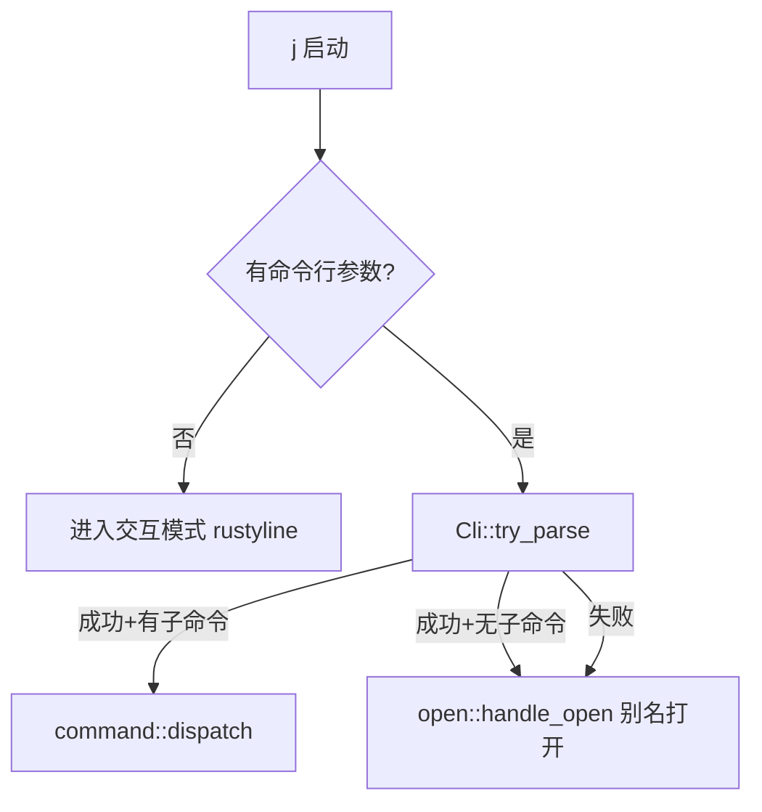

# 架构设计

> 本文档描述 `j` 的整体架构、模块设计和数据模型。

---

## 目录结构

```
src/
├── main.rs              # 入口：clap 解析 + 快捷/交互模式分流
├── cli.rs               # clap derive 宏定义所有子命令（SubCmd 枚举）
├── constants.rs         # 全局常量定义（版本号、section名、分类、搜索引擎等）
├── assets.rs            # 资源管理模块（rust-embed 统一嵌入）
├── interactive/         # 交互模式
│   ├── mod.rs           # 主模块入口
│   ├── completer.rs     # Tab 补全器
│   ├── parser.rs        # 命令解析器
│   └── shell.rs         # Shell 命令执行
├── tui/                 # TUI 模块
│   ├── mod.rs           # 导出
│   └── editor.rs        # 全屏多行编辑器（ratatui + tui-textarea + vim 模式）
├── config/              # 配置管理
│   ├── mod.rs           # 导出
│   └── yaml_config.rs   # YAML 配置 serde 结构体 + 读写 + section 操作
├── command/             # 命令模块
│   ├── mod.rs           # 模块导出
│   ├── handler.rs       # dispatch(SubCmd) 主分发
│   ├── alias.rs         # set / remove / rename / modify
│   ├── category.rs      # note / denote（分类标记管理）
│   ├── list.rs          # ls（列出别名）
│   ├── open.rs          # 打开应用 / URL / 浏览器搜索（核心命令）
│   ├── report.rs        # report / check / search（日报系统）
│   ├── script.rs        # concat（创建脚本）
│   ├── system.rs        # version / help / exit / log / clear / contain / change
│   ├── time.rs          # time countdown（倒计时器）
│   ├── voice.rs         # voice（语音转文字，Whisper.cpp 离线转写）
│   ├── todo/            # 待办备忘录 TUI
│   │   ├── mod.rs       # 入口
│   │   ├── app.rs       # 应用状态
│   │   └── ui.rs        # UI 渲染
│   ├── chat/            # AI 对话 TUI
│   │   ├── mod.rs       # 入口
│   │   ├── handler.rs   # TUI 主循环
│   │   ├── app.rs       # 应用状态 + 后台 Agent 循环
│   │   ├── api.rs       # OpenAI 客户端
│   │   ├── model.rs     # 数据模型
│   │   ├── archive.rs   # 归档管理
│   │   ├── theme.rs     # 主题系统
│   │   ├── render.rs    # 渲染工具
│   │   ├── skill.rs     # Skill 技能系统
│   │   ├── markdown/    # Markdown 解析渲染
│   │   │   ├── mod.rs
│   │   │   ├── parser.rs
│   │   │   └── highlight.rs
│   │   ├── tools/       # 工具系统
│   │   │   ├── mod.rs
│   │   │   ├── shell.rs
│   │   │   ├── skill_tool.rs
│   │   │   └── file/    # 文件操作工具
│   │   │       ├── mod.rs
│   │   │       ├── read.rs
│   │   │       ├── write.rs
│   │   │       └── edit.rs
│   │   └── ui/          # TUI 组件
│   │       ├── mod.rs
│   │       ├── chat.rs
│   │       ├── config.rs
│   │       └── archive.rs
│   └── help/            # 帮助系统 TUI
│       ├── mod.rs
│       ├── app.rs
│       └── ui.rs
├── util/                # 工具函数
│   ├── mod.rs           # 导出
│   ├── log.rs           # info! / error! / usage! / debug_log! 日志宏
│   ├── md_render.rs     # md! / md_inline! Markdown 渲染宏
│   └── fuzzy.rs         # 模糊匹配
└── assets/              # 资源文件（编译时通过 rust-embed 嵌入二进制）
    ├── help.md          # 帮助文档
    ├── version.md       # 版本信息模板
    ├── system_prompt_default.md  # 默认系统提示词模板
    ├── memory_default.md         # 默认记忆占位文件
    └── soul_default.md           # 默认灵魂占位文件
```

---

## 资源嵌入 (`assets.rs`)

使用 `rust-embed` 实现资源嵌入，支持运行时动态查找和迭代：

```rust
use rust_embed::RustEmbed;

#[derive(RustEmbed)]
#[folder = "assets/"]
pub struct Assets;

// 便捷访问函数
pub fn help_text() -> Cow<'static, str>
pub fn version_template() -> Cow<'static, str>
pub fn default_system_prompt() -> Cow<'static, str>
pub fn default_memory() -> Cow<'static, str>
pub fn default_soul() -> Cow<'static, str>
```

**资源清单**：

| 资源名称 | 类型 | 路径 | 用途 |
|---------|------|------|------|
| `HELP_TEXT` | 文本 | `assets/help.md` | 帮助命令输出 |
| `VERSION_TEMPLATE` | 文本 | `assets/version.md` | 版本命令模板 |
| `DEFAULT_SYSTEM_PROMPT` | 文本 | `assets/system_prompt_default.md` | 默认系统提示词模板 |
| `DEFAULT_MEMORY` | 文本 | `assets/memory_default.md` | 默认记忆占位文件 |
| `DEFAULT_SOUL` | 文本 | `assets/soul_default.md` | 默认灵魂占位文件 |

---

## 入口逻辑 (`main.rs`)

```
j               → 进入交互模式（rustyline REPL）
j <子命令>      → clap 解析 → dispatch → 对应 handler
j <别名>        → clap 解析失败 → fallback 到 open::handle_open（别名打开）
```

**核心逻辑流程**：



---

## 命令解析 (`cli.rs`)

使用 `clap::derive` 宏，所有子命令定义在 `SubCmd` 枚举中：

| 子命令 | 别名 | 参数 | 说明 |
|--------|------|------|------|
| `set` | `s` | `<alias> <path...>` | 设置别名 |
| `remove` | `rm` | `<alias>` | 删除别名 |
| `rename` | `rn` | `<alias> <new>` | 重命名 |
| `modify` | `mf` | `<alias> <path...>` | 修改路径 |
| `note` | `nt` | `<alias> <category>` | 标记分类 |
| `denote` | `dnt` | `<alias> <category>` | 解除分类 |
| `list` | `ls` | `[section]` | 列出别名 |
| `contain` | `find` | `<alias> [sections]` | 查找别名所在分类 |
| `report` | `r` | `<content...>` | 写入日报 |
| `reportctl` | `rctl` | `<new\|sync\|push\|pull\|set-url\|open> [arg]` | 日报元数据操作 |
| `check` | `c` | `[line_count\|open]` | 查看最近 N 行日报 / TUI 编辑器打开日报文件 |
| `search` | `select/look/sch` | `<N\|all> <kw> [-f]` | 搜索日报 |
| `todo` | `td` | `[content...]` | 待办备忘录 |
| `chat` | `ai` | `[content...]` | AI 对话 |
| `concat` | — | `<name> [content]` | 创建脚本 |
| `time` | — | `<countdown> <dur>` | 倒计时器 |
| `log` | — | `<key> <value>` | 日志设置 |
| `change` | `chg` | `<part> <field> <val>` | 修改配置 |
| `clear` | `cls` | — | 清屏 |
| `version` | `v` | — | 版本信息 |
| `help` | `h` | — | 帮助信息 |
| `exit` | `q/quit` | — | 退出 |
| `voice` | `vc` | `[-c] [-m model] / download [-m model]` | 语音转文字 |
| `completion` | — | `[zsh\|bash]` | 生成 shell 补全脚本 |

---

## 配置管理 (`config/yaml_config.rs`)

- **配置文件路径**：`~/.jdata/config.yaml`（不存在则自动创建）
- 数据结构：`YamlConfig` 包含多个 `BTreeMap<String, String>` section
- Section 列表：`path`, `inner_url`, `outer_url`, `editor`, `browser`, `vpn`, `script`, `report`, `settings`

### 核心 API

| 方法 | 说明 |
|------|------|
| `YamlConfig::load()` | 加载配置（不存在则创建默认） |
| `data_dir()` | 获取数据根目录 `~/.jdata/` |
| `scripts_dir()` | 获取脚本存储目录 `~/.jdata/scripts/` |
| `get_property(section, key)` | 读取某 section 下的 key |
| `set_property(section, key, val)` | 写入并自动持久化 |
| `remove_property(section, key)` | 删除并持久化 |
| `contains(section, key)` | 判断是否存在 |
| `get_section(name)` | 获取整个 section 的 Map |
| `find_alias(alias)` → `(section, value)` | 在 path/inner_url/outer_url 中查找别名 |
| `is_verbose()` | 是否开启 verbose 日志 |

---

## 交互模式 (`interactive/`)

- 基于 `rustyline` 17，自定义 `CopilotHelper`（实现 Completer + Hinter + Highlighter + Validator）

### Tab 补全（上下文感知）

- 第一个词 → 补全所有命令名 + 已注册别名
- `rm/rename/mf/note/denote <Tab>` → 补全已有别名
- `note <alias> <Tab>` → 补全分类（browser/editor/vpn/outer_url/script）
- `ls/change <Tab>` → 补全 section 名
- `log <Tab>` → 补全 `mode`，`log mode <Tab>` → 补全 `verbose/concise`
- `search <Tab>` → 补全 `all`
- `reportctl <Tab>` → 补全 `new/sync/push/pull/set-url/open`
- `set <alias> /App<Tab>` → 补全文件系统路径
- `mf <alias> /App<Tab>` → 补全文件系统路径
- `time <Tab>` → 补全 `countdown`

### 其他特性

- **历史建议**：`HistoryHinter`（灰色显示上次相同前缀的命令，按 → 接受）
- **历史持久化**：`~/.jdata/history.txt`
- **Shell 命令**：`!` 前缀执行系统命令，自动注入别名环境变量
- **环境变量注入**：`J_<ALIAS_UPPER>` 格式，`$J_XXX` / `${J_XXX}` 自动展开

---

## 全局常量 (`constants.rs`)

所有魔法字符串统一管理：

| 常量组 | 内容 |
|--------|------|
| `VERSION` / `APP_NAME` / `AUTHOR` / `EMAIL` | 版本信息 |
| `section::*` | section 名称（PATH, INNER_URL 等） |
| `ALL_SECTIONS` | 所有 section 名称列表 |
| `NOTE_CATEGORIES` | 可标记分类列表 |
| `config_key::*` | 配置 key 名称 |
| `search_engine::*` | 搜索引擎 URL 模板 |
| `REPORT_*` | 日报相关常量 |

---

## 与 Java 版的对应关系

| Java 类 | Rust 模块 | 说明 |
|----------|-----------|------|
| `WorkCopilotApplication` | `main.rs` + `interactive/mod.rs` | 入口 + 交互模式 |
| `CommandHandlerScanner` | `cli.rs` + `command/handler.rs` | 命令注册 + 分发 |
| `YamlConfig` | `config/yaml_config.rs` | YAML 配置管理 |
| `SetCommandHandler` | `command/alias.rs::handle_set` | 设置别名 |
| `RemoveCommandHandler` | `command/alias.rs::handle_remove` | 删除别名 |
| `OpenCommandHandler` | `command/open.rs::handle_open` | 打开应用/URL |
| `ReportCommandHandler` | `command/report.rs::handle_report` | 写入日报 |
| — | `command/todo/` | 待办备忘录（Rust 新增） |
| — | `command/chat/` | AI 对话 TUI（Rust 新增） |
| — | `command/voice.rs` | 语音转文字（Rust 新增） |
| — | `command/help/` | 帮助系统 TUI（Rust 新增） |
