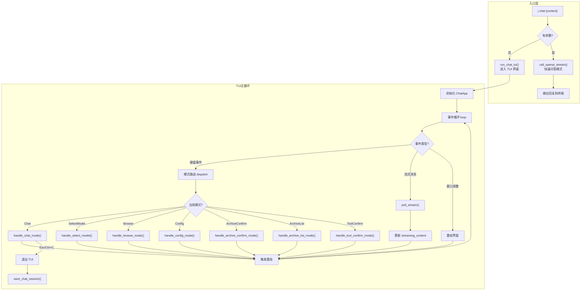
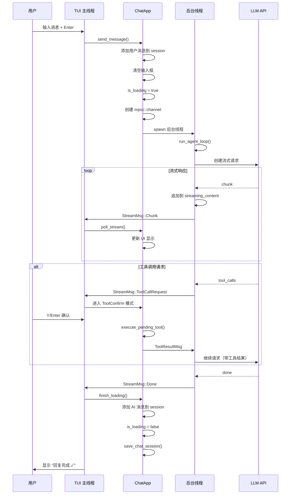
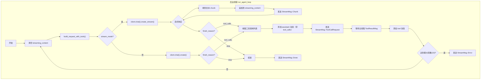
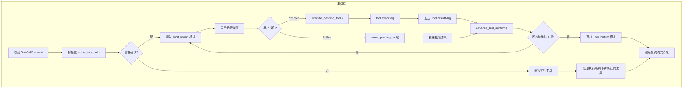
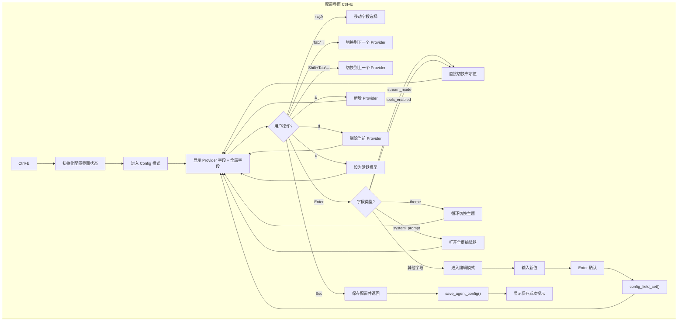
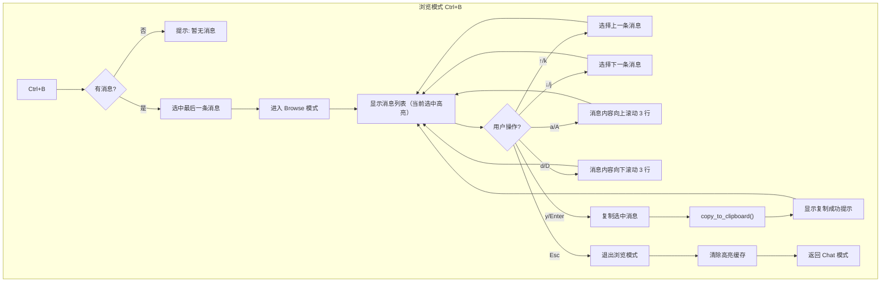
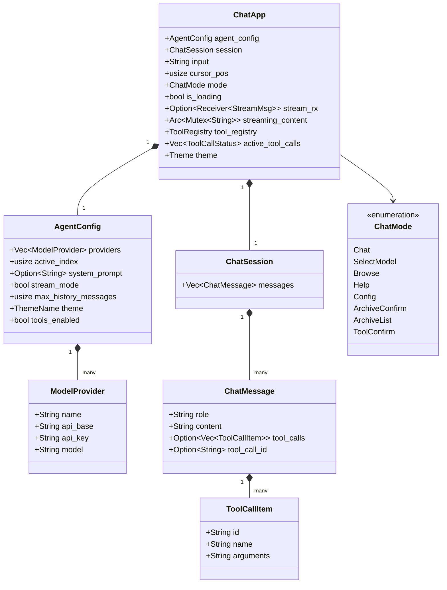
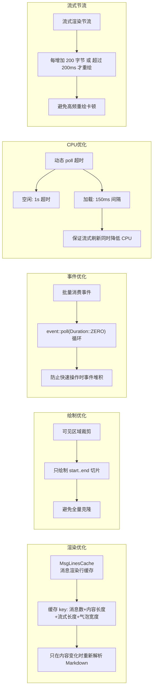

# AI 对话系统

> `j chat` 命令启动内置 TUI AI 对话界面，支持多模型、流式输出、Markdown 渲染、对话持久化、工具调用等功能。

---

## 架构总览

```
src/command/chat/
├── mod.rs           # 入口：handle_chat() 命令分发
├── handler.rs       # TUI 主循环：事件监听 + 模式路由
├── app.rs           # 应用状态：ChatApp + 后台 Agent 循环
├── api.rs           # API 层：OpenAI 客户端 + 请求构建
├── model.rs         # 数据模型：AgentConfig / ChatSession / ChatMessage
├── archive.rs       # 归档管理：创建 / 列表 / 还原 / 删除
├── theme.rs         # 主题系统：6 种配色方案
├── render.rs        # 渲染工具：剪贴板复制
├── skill.rs         # Skill 技能系统
├── tools/           # 工具系统
│   ├── mod.rs           # Tool trait + ToolRegistry
│   ├── shell.rs         # run_shell 工具
│   ├── skill_tool.rs    # load_skill 工具
│   └── file/            # 文件操作工具
├── markdown/        # Markdown 解析渲染
│   ├── mod.rs
│   ├── parser.rs    # pulldown-cmark 解析
│   └── highlight.rs # 代码语法高亮
└── ui/              # TUI 组件
    ├── mod.rs
    ├── chat.rs      # 对话主界面
    ├── config.rs    # 配置编辑界面
    └── archive.rs   # 归档列表界面
```

---

## 数据目录

```
~/.jdata/agent/data/
├── agent_config.json    # 模型提供方配置（API key、模型名等）
├── chat_session.json    # 当前对话历史（自动保存/恢复）
├── style.md             # 回复风格配置
└── archives/            # 归档对话存储目录
    ├── archive-2026-02-25.json
    └── archive-2026-02-26.json
```

---

## 整体交互流程



---

## 用户发送消息流程



---

## Agent 循环（支持多轮工具调用）



---

## 工具调用确认流程



---

## 归档功能流程

```mermaid
flowchart TD
    subgraph 归档 Ctrl+L
        A["Ctrl+L"] --> B{"对话为空?"}
        B -- 是 --> C["提示: 当前对话为空"]
        B -- 否 --> D["start_archive_confirm()"]
        D --> E["生成默认名称 archive-YYYY-MM-DD"]
        E --> F["进入 ArchiveConfirm 模式"]
        F --> G{"用户操作?"}
        G -- "Enter" --> H["使用默认名称归档"]
        G -- "n" --> I["编辑自定义名称"]
        G -- "d" --> J["仅清空对话，不归档"]
        G -- "Esc" --> K["取消"]
        
        I --> L["输入自定义名称"]
        L --> M["Enter 确认"]
        M --> N["validate_archive_name()"]
        N -- "合法" --> H
        N -- "非法" --> O["提示错误，继续编辑"]
        
        H --> P["create_archive()"]
        P --> Q["保存到 archives/name.json"]
        Q --> R["清空当前 session"]
        R --> S["显示成功提示"]
    end

    subgraph 还原 Ctrl+R
        T["Ctrl+R"] --> U["start_archive_list()"]
        U --> V["加载归档列表"]
        V --> W["进入 ArchiveList 模式"]
        W --> X{"用户操作?"}
        X -- "↑↓/j/k" --> Y["移动选择"]
        X -- "Enter" --> Z{"当前有对话?"}
        X -- "d" --> AA["删除选中归档"]
        X -- "Esc" --> AB["取消返回"]
        
        Z -- 是 --> AC["提示确认覆盖"]
        Z -- 否 --> AD["直接还原"]
        AC -- "y/Enter" --> AD
        AC -- "其他" --> W
        
        AD --> AE["restore_archive()"]
        AE --> AF["替换 session.messages"]
        AF --> AG["显示成功提示"]
    end
```



---

## 配置编辑流程



---

## 消息浏览模式流程



---

## 数据模型关系



---

## 性能优化策略



**核心优化点**：
- `MsgLinesCache`：消息渲染行缓存，打字/滚动时零开销复用
- 只渲染可见区域行（`start..end` 切片），避免全量克隆
- 批量消费事件（`event::poll(Duration::ZERO)` 循环），防止快速操作时事件堆积
- 空闲时 1s 超时降低 CPU，加载时 150ms 间隔保证流式刷新
- 流式节流：每增加 200 字节或超过 200ms 才重绘，避免高频重绘卡顿

---

## 配置示例

```json
{
  "providers": [
    {
      "name": "GPT-4o",
      "api_base": "https://api.openai.com/v1",
      "api_key": "sk-xxx",
      "model": "gpt-4o"
    },
    {
      "name": "DeepSeek-V3",
      "api_base": "https://api.deepseek.com/v1",
      "api_key": "sk-xxx",
      "model": "deepseek-chat"
    }
  ],
  "active_index": 0,
  "system_prompt": "你是一个有用的助手。",
  "stream_mode": true,
  "max_history_messages": 20,
  "theme": "dark",
  "tools_enabled": true
}
```

| 字段 | 说明 |
|------|------|
| `providers` | 模型提供方列表（支持任意 OpenAI 兼容 API） |
| `active_index` | 当前使用的 provider 索引 |
| `system_prompt` | 系统提示词（可选，每轮对话前注入） |
| `stream_mode` | `true` 流式输出，`false` 整体输出 |
| `max_history_messages` | 发送给 API 的历史消息数量上限 |
| `theme` | 界面主题风格 |
| `tools_enabled` | 是否启用工具调用功能 |

---

## 快捷键

| 按键 | 功能 |
|------|------|
| `Enter` | 发送消息 |
| `↑/↓` | 滚动对话 |
| `PageUp` / `PageDown` | 快速滚动（10行） |
| `Ctrl+T` | 切换模型提供方 |
| `Ctrl+L` | 归档当前对话 |
| `Ctrl+R` | 还原归档对话 |
| `Ctrl+Y` | 复制最后一条 AI 回复 |
| `Ctrl+B` | 消息浏览模式 |
| `Ctrl+S` | 切换流式/整体输出 |
| `Ctrl+E` | 打开配置界面 |
| `?` | 显示帮助 |
| `Esc` / `Ctrl+C` | 退出对话 |

---

## 配置界面

按 `Ctrl+E` 进入可视化配置界面：

| 按键 | 功能 |
|------|------|
| `↑` / `k` | 向上移动光标 |
| `↓` / `j` | 向下移动光标 |
| `Tab` / `→` | 切换到下一个 Provider |
| `Shift+Tab` / `←` | 切换到上一个 Provider |
| `Enter` | 进入编辑模式 |
| `a` | 新增 Provider |
| `d` | 删除当前 Provider |
| `s` | 将当前 Provider 设为活跃模型 |
| `Esc` | 保存配置并返回 |

---

## 主题风格

| 主题 | 说明 |
|------|------|
| `dark` | 深色主题（默认） |
| `light` | 浅色主题 |
| `dracula` | Dracula 配色 |
| `gruvbox` | Gruvbox 配色 |
| `monokai` | Monokai 配色 |
| `nord` | Nord 配色 |

---

## 工具调用（Function Calling）

### 内置工具

| 工具名 | 功能 | 需确认 |
|--------|------|--------|
| `run_shell` | 执行 shell 命令 | ✅ 是 |
| `read_file` | 读取本地文件 | ❌ 否 |
| `write_file` | 写入文件 | ✅ 是 |
| `edit_file` | 编辑文件 | ✅ 是 |
| `load_skill` | 加载技能完整内容 | ❌ 否 |

### 工具确认

- `Y` / `Enter` → 执行工具
- `N` / `Esc` → 拒绝执行

### 安全策略

`run_shell` 内置危险命令过滤：
- `rm -rf /`、`rm -rf /*`
- `mkfs`、`dd if=`
- `chmod -R 777 /`
- `curl | sh`、`wget -O- | sh`
- `alias`（防止别名劫持）

---

## Skill 技能系统

### 目录结构

```
~/.jdata/agent/skills/
  my-skill/
    SKILL.md           # 主文件（必需）
    references/        # 可选的参考文件目录
    scripts/           # 可选的脚本目录
```

### SKILL.md 格式

```yaml
---
name: my-skill
description: 这个 skill 做什么
argument-hint: "[参数说明]"
---

Markdown 指令正文，$ARGUMENTS 会被替换为实际参数...
```

### 使用方式

| 方式 | 说明 |
|------|------|
| `@skill_name` | 触发技能选择弹窗 |
| `@skill_name 参数` | AI 识别后调用 load_skill |
| 自动调用 | AI 根据 skills 摘要自主决定 |

### @ 补全快捷键

| 按键 | 功能 |
|------|------|
| `@` | 触发技能选择弹窗 |
| `↑` / `↓` | 移动选中项 |
| `Tab` / `Enter` | 补全技能名称 |
| `Esc` | 关闭弹窗 |

---

## 系统提示词模板占位符

| 占位符 | 替换内容 |
|--------|----------|
| `{{.skills}}` | 所有技能的 name + description 摘要 |
| `{{.tools}}` | 所有工具的 name + description 摘要 |
| `{{.style}}` | 回复风格配置内容 |

---

## Markdown 渲染

基于 `pulldown-cmark` 解析，支持：
- 标题、加粗、斜体、删除线
- 行内代码、代码块（语法高亮）
- 列表、表格、引用块、分隔线

### 代码高亮支持

| 语言 | 标识 |
|------|------|
| Rust | `rust`, `rs` |
| Python | `python`, `py` |
| JavaScript/TypeScript | `js`, `ts`, `jsx`, `tsx` |
| Go | `go`, `golang` |
| Java/Kotlin | `java`, `kotlin`, `kt` |
| Bash/Shell | `sh`, `bash`, `zsh` |
| C/C++ | `c`, `cpp` |
| SQL | `sql` |
| Ruby | `ruby`, `rb` |
| YAML/TOML | `yaml`, `yml`, `toml` |
| CSS/SCSS | `css`, `scss` |
| Dockerfile | `dockerfile` |
