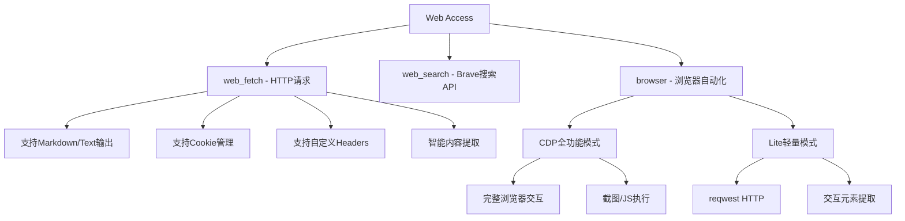
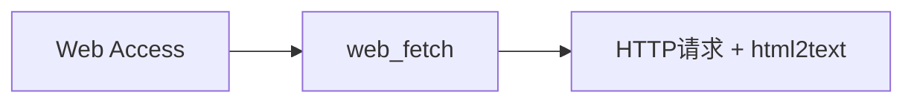
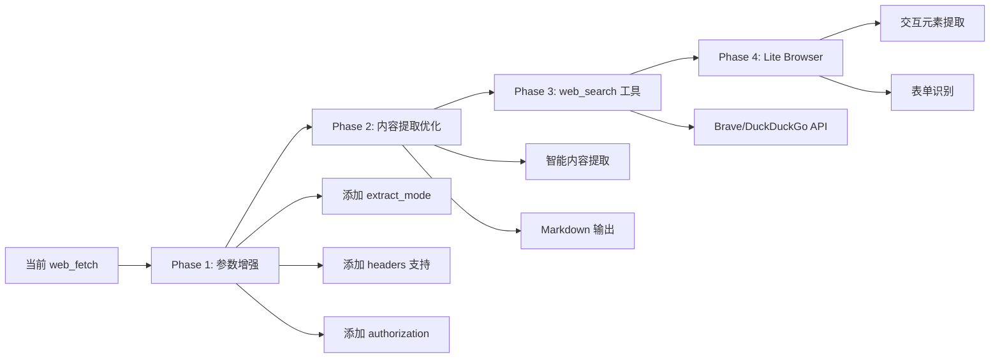

[思考中]
我来帮你调研这两个项目的 web access 实现方式，并提出改进建议。

首先，让我读取 j-cli 项目的 web_fetch.rs 文件：
[读取文件中]
[读取文件中]
[思考中]
现在让我进一步调研 RustyClaw 的工具注册机制和 j-cli 的工具架构：
[查找文件中]
[思考中]
让我使用其他工具来探索 RustyClaw 的工具架构：
[查找文件中]
[思考中]
让我深入查看 RustyClaw 的工具系统核心文件：
[读取文件中]
[查找文件中]
[思考中]
让我继续读取关键文件：
[读取文件中]
[读取文件中]
[读取文件中]
[思考中]
现在我已经完成了对两个项目的调研。让我给你一个详细的分析报告：

---

## 🔍 RustyClaw vs j-cli Web Access 对比分析

### 一、架构设计对比

#### RustyClaw 的多层次设计



#### j-cli 的简单设计



---

### 二、关键差异分析

| 特性 | RustyClaw | j-cli | 影响 |
|------|-----------|-------|------|
| **输出格式** | Markdown/Text 可选 | 仅纯文本 | ⚠️ Markdown 格式更适合 LLM 理解 |
| **内容提取** | 智能语义提取（article/main） | 全文转换 | ⚠️ 语义提取减少噪音 |
| **Cookie 支持** | ✅ 自动管理 | ❌ 无 | ⚠️ 无法访问需登录页面 |
| **自定义 Headers** | ✅ 支持 | ❌ 无 | ⚠️ 无法调用 API |
| **认证支持** | ✅ Authorization 参数 | ❌ 无 | ⚠️ 无法访问受保护资源 |
| **浏览器模式** | ✅ CDP + Lite 双模式 | ❌ 无 | ⚠️ JS 渲染页面无法处理 |
| **网络搜索** | ✅ web_search 工具 | ❌ 无 | ⚠️ 缺少信息检索能力 |

---

### 三、RustyClaw 的亮点实现

#### 1. 智能 HTML 内容提取

```rust
// RustyClaw 按优先级查找语义化内容
let content_selectors = [
    "article",
    "main",
    "[role=\"main\"]",
    ".post-content",
    ".article-content",
    // ...
];
```

#### 2. 双模式 Browser 工具

```rust
// 特性门控设计
#[cfg(feature = "browser")]
mod real {
    // 完整 CDP 实现 - 真实浏览器
}

#[cfg(not(feature = "browser"))]
mod lite {
    // 轻量模式 - reqwest + HTML 解析
    // 仍可提取交互元素（按钮、表单、链接）
}
```

#### 3. Cookie Vault 集成

```rust
// 自动管理 cookies
if use_cookies {
    if let Some(cookie_header) = get_cookie_header_async(domain, path, is_secure).await {
        request = request.header("Cookie", cookie_header);
    }
}
```

---

### 四、改进提案

#### 提案 1：增强 web_fetch 参数（基础改进）

**优先级：高 | 实现难度：低**

```rust
// 建议添加的参数
fn parameters_schema(&self) -> Value {
    json!({
        "type": "object",
        "properties": {
            "url": { "type": "string", "description": "URL地址" },
            "extract_mode": { 
                "type": "string", 
                "enum": ["markdown", "text"],
                "default": "markdown",
                "description": "输出格式"
            },
            "max_chars": { 
                "type": "integer", 
                "default": 50000,
                "description": "最大字符数"
            },
            "authorization": {
                "type": "string",
                "description": "Authorization 头（如 'Bearer xxx'）"
            },
            "headers": {
                "type": "object",
                "description": "自定义请求头"
            }
        },
        "required": ["url"]
    })
}
```

#### 提案 2：智能内容提取（中等改进）

**优先级：中 | 实现难度：中**

```rust
// 添加语义化内容提取
fn extract_readable_content(html: &str) -> String {
    // 1. 尝试提取 article/main 等语义标签
    // 2. 移除 nav/header/footer/nav/script/style
    // 3. 保留核心内容
}

// 添加 html2md 支持（比 html2text 更适合 LLM）
fn html_to_markdown(html: &str) -> String {
    // 使用 html2md 库转换
}
```

#### 提案 3：Lite 模式 Browser 工具（高级改进）

**优先级：中 | 实现难度：中**

```rust
/// 轻量级浏览器模式 - 无需真实浏览器
pub struct LiteBrowserTool;

impl Tool for LiteBrowserTool {
    fn name(&self) -> &str { "browser" }
    
    fn execute(&self, args: &str, _: &Arc<AtomicBool>) -> ToolResult {
        let action = parse_action(args);
        match action {
            "open" | "navigate" => {
                // 使用 reqwest 获取页面
                // 解析 HTML 提取交互元素
                // 返回结构化信息
            }
            "snapshot" => {
                // 返回页面元素结构（按钮、链接、表单）
            }
            _ => ToolResult { output: "...", is_error: false }
        }
    }
}
```

#### 提案 4：添加 web_search 工具

**优先级：高 | 实现难度：低**

```rust
/// 网络搜索工具
pub struct WebSearchTool;

impl Tool for WebSearchTool {
    fn name(&self) -> &str { "web_search" }
    
    fn execute(&self, args: &str, _: &Arc<AtomicBool>) -> ToolResult {
        // 使用 Brave Search API 或 DuckDuckGo API
        // 返回搜索结果列表
    }
}
```

---

### 五、推荐实施路径



---

### 六、总结建议

| 提案 | 投入产出比 | 建议 |
|------|-----------|------|
| 参数增强 | ⭐⭐⭐⭐⭐ | **立即实施** - 小改动大提升 |
| 内容提取优化 | ⭐⭐⭐⭐ | **短期实施** - 提升内容质量 |
| web_search 工具 | ⭐⭐⭐⭐ | **短期实施** - 补充信息检索能力 |
| Lite Browser | ⭐⭐⭐ | **中期规划** - 需要 JS 渲染时再考虑 |

**核心建议**：j-cli 的 web_fetch 当前过于简单，建议优先实施提案 1（参数增强）和提案 2（内容提取优化），这两个改动投入小但收益大，能显著提升工具的实用性。