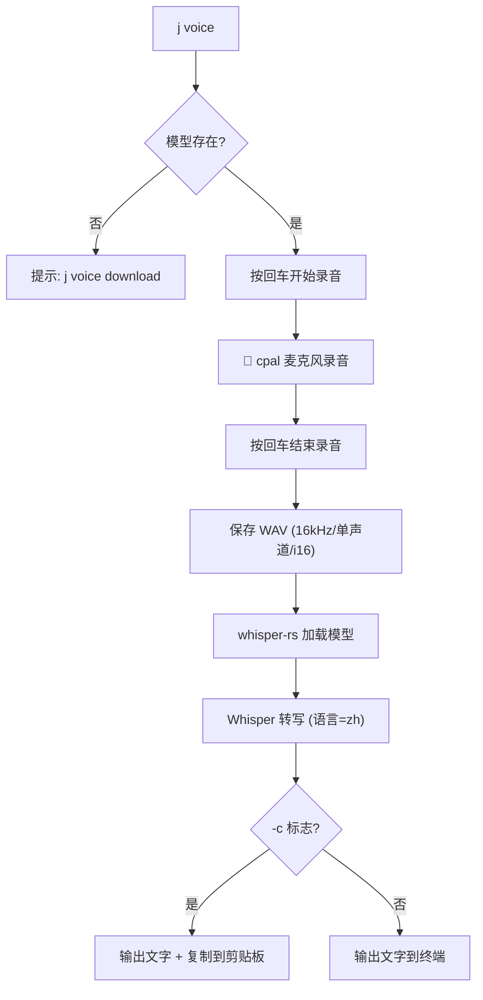

# 语音转文字

> `j voice` 命令提供基于 Whisper.cpp 的离线语音转文字功能，支持中文识别，无需联网。

---

## 架构

```
~/.jdata/voice/
├── model/
│   └── ggml-small.bin    # Whisper 模型文件
└── recording.wav         # 临时录音文件（转写后自动删除）
```

---

## 核心流程



---

## 使用方式

### 下载模型

```bash
j voice download           # 下载默认模型（small，466MB）
j voice download -m medium # 下载 medium 模型（1.5GB）
```

### 录音转文字

```bash
j voice                    # 录音 → 转写 → 输出到终端
j voice -c                 # 录音 → 转写 → 复制到剪贴板
j voice -m medium          # 使用 medium 模型转写
j vc                       # 别名，等价于 j voice
```

### 配合其他命令

```bash
j report "$(j voice)"      # 语音写日报
j todo "$(j voice)"        # 语音添加待办
```

---

## 模型选择

| 模型 | 大小 | 中文质量 | 速度（M1 30s音频）| 推荐度 |
|------|------|---------|-----------------|--------|
| `tiny` | 75MB | ⭐⭐ | <1s | 不推荐中文 |
| `base` | 142MB | ⭐⭐⭐ | ~1s | 凑合用 |
| `small` | 466MB | ⭐⭐⭐⭐ | ~2s | ✅ 默认推荐 |
| `medium` | 1.5GB | ⭐⭐⭐⭐⭐ | ~3s | ✅ 中文最佳 |
| `large` | 3.1GB | ⭐⭐⭐⭐⭐ | ~6s | 追求极致精度 |

---

## 技术实现

- **录音**：`cpal` crate 捕获系统默认麦克风，16kHz 单声道 f32 采样
- **WAV 写入**：`hound` crate 将采样数据写入 16bit PCM WAV 文件
- **转写**：`whisper-rs` crate（Whisper.cpp 的 Rust 绑定），Greedy 解码策略，语言设为中文
- **模型下载**：通过 `curl` 从 Hugging Face 下载 ggml 格式模型文件
- **剪贴板**：macOS 通过 `pbcopy` 复制

---

## 注意事项

- 首次录音时 macOS 会弹出麦克风权限请求，需要用户授权
- 编译需要系统安装 `cmake`（`brew install cmake`）
- 模型文件较大，不嵌入二进制，需要用户首次使用时手动下载
